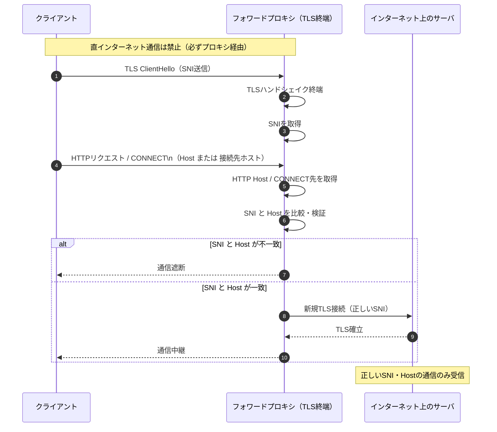
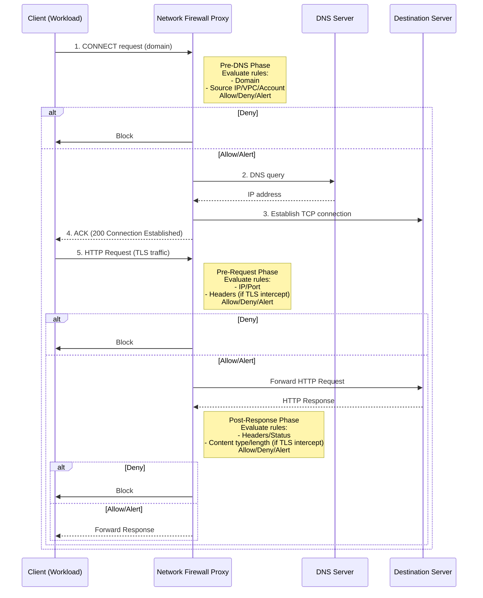

## はじめに
re:Invent2025直前の、2025/11/25にとあるアップデートがありました。

https://aws.amazon.com/jp/about-aws/whats-new/2025/11/aws-network-firewall-proxy-preview/

> お客様は Network Firewall Proxy を使用して、ウェブトラフィックとネットワーク間のトラフィックを効率的に管理および保護できます。ドメイン名や Server Name Indication (SNI) のなりすましの試みから組織を保護し、きめ細かなアクセスコントロールを柔軟に設定できます。Network Firewall Proxy を使用して、アプリケーションからのアクセスを信頼できるドメインまたは IP アドレスに制限したり、外部サーバーからの意図しない応答をブロックしたりできます。TLS インスペクションを有効にして、HTTP ヘッダー属性に対するきめ細かいフィルタリング制御を設定することもできます。Network Firewall Proxy は、アプリケーションを監視するための包括的なログを提供します。ログを有効にして Amazon S3 と AWS CloudWatch に送信し、詳細な分析と監査を行うことができます。

とあるので、かなり詳細にアウトバウンドトラフィックの検査ができそうです。
今回は遅ればせながらこのアップデートについて深掘りをしていきたいと思います。

:::message
本記事は2026/1/10時点の情報を元に作成しています。サービスがGAされたり機能が追加されている場合がありますので、公式から最新の情報もご確認ください。
:::


## アウトバウンドトラフィック制御とは
アウトバウンドトラフィック（内部→外部への通信）に対して、通信を**許可**/**拒否**/**制限**する動作のことを言います。
オンプレミス環境からインターネット環境に出る境界部分などで実施されていることが多いと思います。AWS上でも、NATGatewayを介して外部に通信が出ていく前後で何かしらの制御をしていることが多いのではないでしょうか。

このアウトバウンドトラフィック制御がなぜ必要なのかというと、一番の目的はマルウェアに感染した場合にマルウェアがC&Cサーバと通信を行い、内部データを不正に外部送信することを防ぎます。
最近の[ブラウザ拡張機能を利用した情報窃取事例](https://www.infosecurity-magazine.com/news/shadypanda-infects-43m-chrome-edge/)なども、アウトバウンドトラフィック制御下であれば防げた可能性が高いものでした。

また、踏み台にされ二次被害を広げる足がかりにもなるので、アウトバウンドトラフィックも正しく制御することが重要になってきています。

Network Firewall Proxyで設定できる制御手法については以下の通りです。
1. SNIスプーフィング対策
2. TLS検査/HTTPヘッダ検査
3. DNSトンネリング対策(限定的)

それぞれ簡単に解説していきます。

### SNIスプーフィング対策
**SNIスプーフィング**とは、TLS通信の開始時に送られる SNI（Server Name Indication） を偽装し、**本来アクセスするつもりのないドメイン名を装って通信する**攻撃手法です。

:::details SNIスプーフィングの流れ
1. クライアントはTLSハンドシェイク時に「接続したいドメイン名（SNI）」を送る
2. 攻撃者はこの SNI だけを偽のドメインにする
3. サーバーや中間機器（WAF / CDN / フィルタ）はSNIを信じて処理する
4. 実際の通信内容（HTTP Hostや証明書検証先）と食い違いが発生
:::

従来のFirewallルールでドメイン制限をしていたとしても、ハンドシェイク時に意図しない宛先にすり替えられていると通信ができてしまうという課題がありました。
実際curlコマンドでも偽装は可能です。

```bash
# 許可ドメイン（example.com）のSNIを偽装して、実際には攻撃者のIPアドレスに接続(ここではサンプルドメイン・IPを使用しています)
curl --resolve example.com:443:192.0.2.1 https://example.com/
```

これがプロキシを用いれば、プロキシがTLS終端となることで一度全ての通信を検査し、再度SNIとHTTP Hostが一致するかを確認することで、不正な通信を遮断できます。

:::details シーケンス図

:::

### 2. TLS検査/HTTPヘッダ検査
先ほどのプロキシを経由した通信フローの中で、実際の通信を一度復号化し任意のHTTPヘッダなどをチェックする方法です。
HTTPSの通信でHTTPヘッダをチェックするためには、暗号化されたHTTPS通信を一度復号化する必要があり、それが**TLS検査**です。

HTTPヘッダには様々な攻撃に伴う情報が付与されることが多く、ここを適切に制御できるとよりセキュアな環境を作ることができます。

:::details ヘッダ情報例
|ヘッダ|検査内容例|
|:--|:--|
|User-Agent|不審なツール(curl/sqlmap等)|
|Authorization|異常な認証方式|
|Cookie|セッション固定・改ざん|
|Content-Type|偽装されたアップロード|

他にもPathやアプリ種別なども検査可能
:::

### 3. DNSトンネリング対策
DNS通信は一般的に外部通信が許可されていることが多く、攻撃者から狙われやすいポイントになります。サブドメインなどに情報を付与しDNSクエリに見せかけて情報を窃取する攻撃を**DNSトンネリング**と言います。
攻撃のポイントがいくつかあるので、ログや異常検知機能で検知することは可能です。

:::details 検知ポイント
1. 異常に長いサブドメイン
2. クエリ頻度が高い
3. NXDOMAIN（存在しないドメイン）が多発
4. TXTレコードへの偏り(双方向通信の懸念)
:::

対策としては、以下の方法が挙げられます。
* 社内DNS/フォワーダを経由する
* DNS over HTTPS/TLSを許可しない（特定のDoHサーバのみ許可する）

なお、一般的な構成であればプロトコルが違うので**DNS通信はプロキシを経由しない**ため、明示的にクライアント側のDNS設定をプロキシに向け、プロキシがDNSフォワーダの役割をするようにしなければいけません。


## 従来のサービスとの比較
AWSにはネットワークセキュリティサービスが多数存在します。Network Firewall Proxyがどう違うのか、何に有効なのかを整理します。

| サービス | SNIスプーフィング対策 | TLS検査/HTTPヘッダ検査 | DNSトンネリング対策 | 型 |
|:--|:-:|:-:|:-:|:-:|
| Network Firewall |×|⚪︎|×|透過型|
| DNS Firewall |△|×|⚪︎|透過型|
| Squid(on EC2/ECS) |⚪︎|⚪︎|×|透過型/明示型|
| Network Firewall Proxy |⚪︎|⚪︎|△|明示型|

:::details プロキシの型
プロキシの型とは、クライアントがプロキシの存在を意識しないといけないかどうかです。
* 透過型
    * クライアント（ブラウザや端末）側ではプロキシ設定を行わなくても、ルータやスイッチ、ファイアウォール側でトラフィックを横取りして自動的にプロキシを経由させる方式
* 明示型
    * クライアント側で「プロキシサーバのIPアドレス」と「ポート番号」をブラウザやOS設定に明示的に設定して利用する方式
:::

## 構成
Network Firewall Proxyを使用する際の構成については[ホワイトペーパー](https://docs.aws.amazon.com/ja_jp/network-firewall/latest/developerguide/proxy-architecture-overview.html)を見てもらうのが一番正確かと思います。


*ホワイトペーパーから引用*

Network Firewall Proxyを設定すると自動的にNAT Gatewayと同じサブネットにエンドポイントが作成されます。

:::message alert
NAT Gatewayへのバイパスルートになってしまうため、すでにNAT Gatewayに対してルーティング設定がされている場合は、**プライベートサブネットのルーティングでNAT Gatewayを明示している場合は削除する**ようにしてください。
:::

:::details Network Firewal Proxyのフロー

:::

### Network Firewall ProxyのPhase
Network Firewall Proxyには**Phase**という考え方でそれぞれルールを設定します。

|Phase|内容|
|:--|:--|
|Pre-DNS|CONNECTリクエスト受信直後、DNS解決前にドメイン、ソースIP/VPC/アカウントを検査します。悪意ドメインブロックやドメインallowリストに適します。|
|Pre-request|DNS解決後、HTTPリクエスト送信前にIP/ポート、ヘッダー（TLSインターセプト時: メソッド/URL）を検査します。POSTブロックやIP制限に使えます。|
|Post-response|レスポンス受信後、クライアント返却前にヘッダー/ステータス/コンテンツタイプを検査します。特定コンテンツ（画像/実行ファイル）ブロックに有効です。|


## 環境構築
ここから実際に検証してみます。なお、VPCの構築に関しては記載を省略し、クライアントにはCloudShellをVPCにアタッチして利用します。

:::message
現状はオハイオリージョン(us-east-2)のみで利用可能です。
:::

プレビュー期間中は料金はかかりません。

### Step1: プロキシルールグループの作成
まずはプロキシルールグループを作成します。ここで実際に評価したいルールをセットします。
一度に作成するルールは条件が全てに反映されてしまうので、個別の条件をフェーズごとに設定する場合は、一度ルールセットを作成した後に個別にルールを追加してください。

**VPC > Netwrok Firewall > Proxy Rule Group**


またルールはCSVでエクスポートできます。ファイルにはヘッダー行以下は2行で1ルールの形で出力されます。（インポート機能は今のところなさそうです。）
```csv
rulePriority,ruleHookType,ruleName,ruleAction,conditionKey,conditionOperator,conditionValue
0,PreDNS,test-pre-dns,ALLOW,,,
,PreDNS,test-pre-dns,ALLOW,request:DestinationDomain,StringEquals,".amazonaws.com,.aws.amazon.com,httpbin.org,google.com"
0,PreREQUEST,test-pre-req,DENY,,,
,PreREQUEST,test-pre-req,DENY,request:Http:Method,StringEquals,POST
0,PostRESPONSE,test-post-res,ALERT,,,
,PostRESPONSE,test-post-res,ALERT,response:Http:StatusCode,NumericEquals,500
```


### Step2: プロキシ設定の作成
プロキシ設定では、デフォルト設定とアタッチしたいルールグループを選択します。
デフォルトアクションはどのルールにもマッチしなかった場合に適用されるアクションです。PreDNSをデフォルトDENYにしておくと、ルールグループで許可リストとして宛先を管理できるようになります。

**VPC > Netwrok Firewall > Proxy Configuration**


### Step3: プロキシの作成
最後にNAT Gatewayに関連づけてプロキシを作成します。
その際に、HTTPポートの変更やログの出力設定ができるので適宜設定を変更します。

作成が完了すると、エンドポイント(com.amazonaws.us-east-2.nfw.proxy.xxxxxxx)がdefaultセキュリティグループがアタッチされて作成されているので、セキュリティグループは適宜インバウンドルールを編集してください。

## 動作確認
Netwrok Firewall Proxyは明示的プロキシなので、ホスト環境にプロキシ設定が必要です。今回はCloudShellをVPCにアタッチしているので、以下の手順でプロキシ設定しておきます。

```bash
# プロキシエンドポイントの設定
PROXY_ENDPOINT="<Proxy FQDN>"  # 例: xxxxxxxxxxxx.proxy.nfw.us-east-2.amazonaws.com

# プロキシ環境変数の設定（ポートを変更している場合は変更）
export http_proxy="http://${PROXY_ENDPOINT}:1080"
export https_proxy="https://${PROXY_ENDPOINT}:443"
```

### PreDNSフェーズ
ここでは許可されたドメインへのリクエストが成功することを確認します。
再度ドメインリストを整理します。

|ドメイン|想定|
|:--|:--|
|.aws.amazon.com|サブドメイン含めて許可|
|.amazonaws.com|サブドメイン含めて許可|
|google.com|サブドメインは拒否|
|yahoo.co.jp|拒否|

:::details 結果
```bash
# 許可されたドメイン
curl -I https://aws.amazon.com
## HTTP/1.1 200 Connection Established

# 許可されたサブドメイン
curl -I https://docs.aws.amazon.com
## HTTP/1.1 200 Connection Established

# 許可されていないサブドメイン
curl -I https://www.google.com
## HTTP/1.1 403 Forbidden

# 許可されていないドメイン
curl -I https://yahoo.co.jp
## HTTP/1.1 403 Forbidden
```
:::

### PreREQUESTフェーズ
ここではHTTPメソッドに基づいたアクセス制御を確認します。
アクセスチェックのために`httpbin.org`を利用するため、PreDNSのドメインリストに追加しています。

POSTメソッドを拒否しているので、メソッドごとにリクエストして結果を確認します。

:::details 結果
```bash
# GET
~ $ curl -I http://httpbin.org/get
HTTP/1.1 200 OK
Access-Control-Allow-Credentials: true
Access-Control-Allow-Origin: *
Connection: keep-alive
Content-Length: 254
Content-Type: application/json
Date: Sat, 10 Jan 2026 04:52:48 GMT
Server: gunicorn/19.9.0

# POST
~ $ curl -I -X POST http://httpbin.org/post
HTTP/1.1 403 Forbidden
Content-Type: text/plain; charset=utf-8
X-Content-Type-Options: nosniff
Date: Sat, 10 Jan 2026 04:53:28 GMT
Content-Length: 10
```
:::

### PostRESPONSE
ここではレスポンスのステータスコードによる監視を行います。外部の接続先の状態を確認することにも使えます。
ここでも`httpbin.org`を利用してアクセス制御をチェックします。

DENY設定ではなく、Alert設定にしているので、CloudWatchにログが出力されていることを確認します。

:::details 結果
```bash
# 200レスポンス
~ $ curl -I http://httpbin.org/status/200
HTTP/1.1 200 OK
Access-Control-Allow-Credentials: true
Access-Control-Allow-Origin: *
Connection: keep-alive
Content-Length: 0
Content-Type: text/html; charset=utf-8
Date: Sat, 10 Jan 2026 04:55:51 GMT
Server: gunicorn/19.9.0

# 404レスポンス
~ $ curl -I http://httpbin.org/status/404
HTTP/1.1 404 Not Found
Access-Control-Allow-Credentials: true
Access-Control-Allow-Origin: *
Connection: keep-alive
Content-Length: 0
Content-Type: text/html; charset=utf-8
Date: Sat, 10 Jan 2026 04:56:28 GMT
Server: gunicorn/19.9.0

# 500レスポンス
~ $ curl -I http://httpbin.org/status/500
HTTP/1.1 500 Internal Server Error
Access-Control-Allow-Credentials: true
Access-Control-Allow-Origin: *
Connection: keep-alive
Content-Length: 0
Content-Type: text/html; charset=utf-8
Date: Sat, 10 Jan 2026 04:56:45 GMT
Server: gunicorn/19.9.0
```

```json:CloudwatchLogs
{
    "event_timestamp": 1768021005,
    "proxy_name": "test-proxy",
    "client_src_ip": "10.0.142.68",
    "final_action": "allow",
    "src_vpc": "vpc-0b502cd779409e20d",
    "dest_domain": "httpbin.org.",
    "http_method": "HEAD",
    "dest_ip": "54.158.135.159",
    "http_status_code": 500,
    "final_rule_name": "default",
    "final_rule_group_name": ""
}
```
:::

正しくログが記録されているので、このアクセスログの増減を元にアラートするなどで異常検知も可能になります。
（なお、ALLOW側のログにも出力されます。）


## まとめ
* NAT Gatewayに対してProxyの設定がアタッチできる（VPCエンドポイントが自動作成される）
    * Regional NAT Gatewayに対してはアタッチ不可
    * 複数AZで複数NAT Gatewayを利用している場合はそれぞれに設定をアタッチする必要がある
    * ただし、プレビュー期間中は[アカウント内に1つまで](https://docs.aws.amazon.com/ja_jp/network-firewall/latest/developerguide/limits-of-the-proxy-service.html)なので未検証
* 明示型プロキシとして動作する
    * クライアントへのプロキシ設定が必要
* NAT Gatewayへのルーティングがある場合は削除する
* SNIスプーフィング攻撃に対応
* リクエストのフェーズごとにルールを設定し細かな制御が可能
    * フェーズごとにドメインフィルタリング・SNIスプーフィング検出・HTTPメソッド検査・Content-Type検査などに対応
* TLS検査もプライベート証明書を設定することで対応可能

## さいごに
NAT Gatewayに紐づけてProxyが簡単に導入できるようになり、非常に使いやすい機能だと思います。
普段SquidをEC2やECSで運用している方には特に効果は高いのではないでしょうか。セキュリティ運用に対するコストは重く見られない反面、事が起きてからでは遅いのでこういったサービス化してくれるのは個人的にとても嬉しいです。

GAの際にできる限り良心的な料金で利用できることを願っています！

最後まで読んでいただきありがとうございました。

## 検証時のメモ
### Invalid condition at index 0 for rule test-ua in preREQUEST rule phase: Condition key does not support ForAnyValue or ForAllValues
PreREQUESTに対して、User-Agentでのフィルタリングをしたかったのですが、`Invalid condition at index 0 for rule test-ua in preREQUEST rule phase: Condition key does not support ForAnyValue or ForAllValues`というエラーになり設定できませんでした。ただ、選択肢は全て`ForAnyValue`または、`ForAllValues`なのでここは別途調査が必要です。

