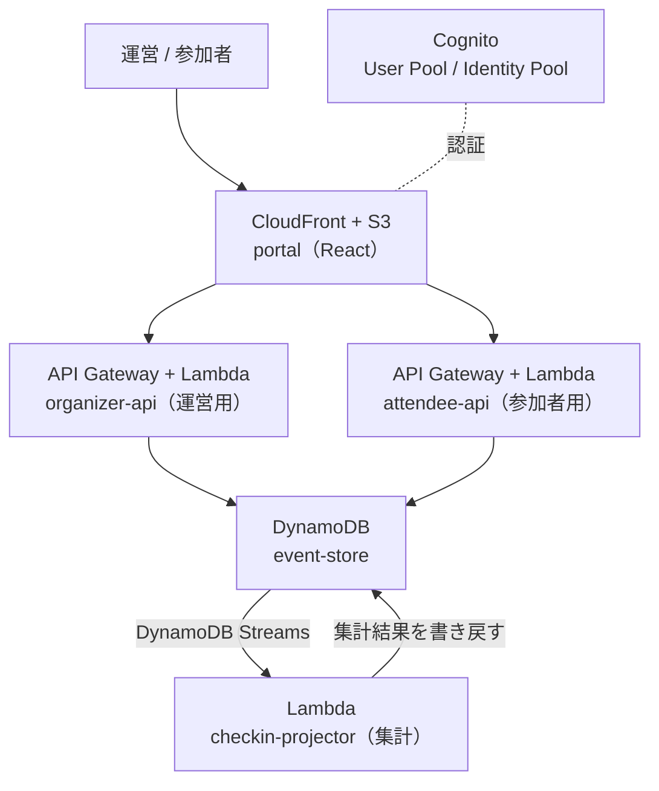

# はじめに
みなさん、`Nx` って触ったことありますか？

私は正直、「フロントエンドのモノレポでよく聞くやつ」くらいの認識で、自分から触りにいったことはありませんでした。。

そんな中、2026年9月に AWS から **Nx Plugin for AWS 1.0** が公開されました。

https://aws.amazon.com/about-aws/whats-new/2026/09/nx-plugin-for-aws/

ジェネレータでフルスタックアプリの雛形を一気に作れる、というツールなのですが、リリース記事やブログを読んでいて一番私が引っかかったのがここでした。

> defining infrastructure as either AWS Cloud Development Kit (AWS CDK) constructs or Terraform modules

**インフラを CDK でも Terraform でも書ける**、と書いてあるんですね。

日本語の紹介記事も含めて、出てくる例はほぼ CDK なのですが、私は業務で Terraform を書くことのほうが多いです。「Terraform を選んだときにどこまで同じ体験になるのか」がどうしても気になったので、実際に手を動かして検証してみました。

:::message
この記事は、`Nx 23.2.0` / `@aws/nx-plugin 1.0.0` / `Terraform 1.14.5` / AWS provider `6.63.0` で検証した内容がベースです。バージョンが上がると生成物は変わる可能性があるので、その点はご承知おきください。
:::

検証に使ったリポジトリは公開していないのですが、実際に動かしたコードはこの記事の中に載せていきます。

## 題材：社内勉強会の受付・チェックインシステム
ジェネレータを一通り試したかったので、題材として**社内勉強会の受付・チェックインシステム**を作りました。この記事では `EventDesk` と呼びます。

登場人物は2人だけです。

- **運営**：イベントを作って公開し、当日は受付でチェックインする
- **参加者**：公開されたイベントを見て申し込む

この2つを **API ごと分けて**、「定員を超えていないか」「申し込み済みか」「すでにチェックイン済みか」といった業務ルールだけを共有ライブラリに置く、という「モノレポにする意味がある」構成にしています。この共有ライブラリを1行変えたときに、アプリとインフラがどこまで連動するのか。ここが5章の主題になります。

AWS 側の構成はこんな形です。



業務ルールを持つ `domain` は、2つの API とワーカーの**どちらからも参照される TypeScript のライブラリ**です。図には出てきませんが、5章の主役になります。

Nx のプロジェクトと役割の対応はこうなります。**以降の章では、この名前がそのまま出てきます**ので、ここだけ頭に入れていただけると読みやすいかと思います。

| プロジェクト | 役割 |
| --- | --- |
| `domain` | 業務ルール（`canCheckIn()` など）を持つ共有ライブラリ。ほぼ全員が参照する |
| `event-store` | DynamoDB 単一テーブル（ElectroDB）。イベント / 申し込み / チェックインを格納 |
| `organizer-api` | **運営用**の tRPC API。イベント作成・公開・チェックイン |
| `attendee-api` | **参加者用**の tRPC API。イベント一覧・申し込み |
| `workers`（`checkin-projector`） | DynamoDB Streams を購読して申込数・チェックイン数を集計する Lambda |
| `portal` | React + Cognito 認証のポータル。運営画面と参加者画面の両方 |
| `infra` | Terraform のルートモジュール。上記すべてをデプロイする |
| `ops-alarms` | 自作の Terraform モジュール（Lambda の CloudWatch アラーム） |
| `common/terraform` | ジェネレータが吐いた Terraform モジュールが溜まっていく場所 |

ワークスペース名は `nx-plugin-demo` なので Nx 上のプロジェクト名は `@nx-plugin-demo/organizer-api` のようになり、Terraform 側のリソース名の接頭辞（`name_prefix`）には `eventdesk-` を使っています。以降のコード例に出てくる `eventdesk` は、この題材の名前だと思ってください。

記事の流れはこんな感じです。インフラ寄りの方に読んでいただきたいので、**そもそも Nx が何なのか**にページを割いています。

1. Nx Plugin for AWS 1.0 のリリース紹介
2. そもそも Nx とは何なのか（インフラ寄りの人向け）
3. Terraform で使うにはどうするのか
4. デプロイしてみる
5. 更新したときに Nx はどこまで差分を見ているのか
6. 実際に使ってみて感じたメリット
7. ハマったところ・注意点

# 1. Nx Plugin for AWS 1.0 とは
まずはリリースの話からです。

https://github.com/awslabs/nx-plugin-for-aws

`@aws/nx-plugin` は、**AWS 上のアプリケーションを作るためのコードジェネレータ集**です。Apache 2.0 の OSS として `awslabs` 配下で公開されています。AWS Open Source Blog でも紹介されています。

https://aws.amazon.com/blogs/opensource/build-full-stack-aws-applications-in-minutes-with-ai-powered-scaffolding/

ざっくり特徴を挙げるとこのあたりかと思います。

- **30 種類以上のジェネレータ**。TypeScript / Python / React に対応していて、API（tRPC / FastAPI / Smithy）、DynamoDB、RDB、React サイト、Lambda、MCP サーバー、Bedrock AgentCore 上の AI エージェントまで揃っています
- **インフラは CDK コンストラクト or Terraform モジュール**として生成される。WAF、CloudWatch へのアクセスログ、X-Ray トレースといった推奨構成が最初から入っています
- **生成されたコードは自分のもの**。プラグインへのランタイム依存がないので、生成後に好きなだけ手を入れられます。あとからプラグイン側の改善を取り込みたいときは Nx の migration を使う、という設計です
- **`connection` ジェネレータ**でプロジェクト同士を繋ぐと、型安全なクライアントが生成される。API の破壊的変更が「本番でのリクエスト失敗」ではなく「ビルドエラー」になります
- **MCP サーバー（`@aws/nx-plugin-mcp`）が同梱**されていて、AI コーディングエージェントからジェネレータを呼べます

私が「これは良さそうだな」と思ったのは4つ目です。フロントとバックエンドの繋ぎ込みって、結局どこかで型が切れて事故るポイントだと思っているので、そこをビルドエラーに落としてくれるのはありがたいです。

CDK 版の解説は AWS Japan の記事がとても分かりやすかったので、まずこちらを読まれるのをおすすめします。

https://zenn.dev/aws_japan/articles/nx-plugin-for-aws-nx-explained

この記事は、その裏返しで **「じゃあ Terraform だとどうなるの？」** をやってみた、という位置づけです。

# 2. そもそも Nx とは（インフラ寄りの人向け）
ここが一番書きたかったところです。

「Nx Plugin for AWS がすごい」という話をするには、まず Nx を分かっている必要があるのですが、インフラ側の人間だと Nx に触れる機会がそもそも少ないと思っています。私もそうでした。

## Nx は「モノレポ用のビルドシステム」
Nx を一言でいうと、**1つのリポジトリに複数のプロジェクトが入っている状態を、まともに扱えるようにする仕組み**です。

これ、実は Terraform を書いている人にはかなり馴染みのある話だと思っています。対応づけるとこんな感じです。

| Nx の概念 | Terraform でいうと | 説明 |
| --- | --- | --- |
| プロジェクト（project） | ルートモジュール / 再利用モジュール | ビルドやテストの単位。1ディレクトリ1プロジェクト |
| ターゲット（target） | `terraform plan` / `apply` などの操作 | プロジェクトに対して実行できるコマンドの定義 |
| プロジェクトグラフ | `module` の依存関係 | 誰が誰に依存しているかのグラフ |
| `nx affected` | 変更したモジュールに依存するものだけ `plan` | 影響範囲だけを再実行する |
| キャッシュ | （相当するものはない） | 入力が変わっていなければ実行そのものをスキップ |
| ジェネレータ | `terraform init -from-module` 的な雛形生成 | 規約に沿ったコードを生成する |

特にインフラの人に刺さるのは、下の3つだと思います。

**プロジェクトグラフ**は、Terraform で `module "vpc"` と `module "eks"` があって EKS が VPC の出力を参照している、というあの関係を、リポジトリ全体（TypeScript も Terraform も含めて）に広げたものです。

**`nx affected`** は、そのグラフを使って「今回の変更で影響を受けるプロジェクトだけ」を選んでビルド・テストします。CI で全部の `plan` を回して10分待つ、みたいな状況を避けられます。

**キャッシュ**は、入力（ソースファイル、依存プロジェクトの成果物、環境変数など）のハッシュが前回と同じなら、コマンドを実行せずに前回の結果を復元する仕組みです。これが効くと、2回目以降の `nx build` がほぼ一瞬で終わります。

## ジェネレータは「scaffolding」
そしてもう一つが**ジェネレータ**です。

```sh
pnpm nx g @aws/nx-plugin:ts#api organizer-api --framework=trpc --auth=iam --infra=rest-lambda
```

こういうコマンドを打つと、API のコード・テスト・ビルド設定・そして **Terraform モジュール**までが、規約に沿った形で生成されます。

インフラ屋的な言い方をすると、**「社内のよくできた Terraform モジュール置き場と、それを呼び出す雛形ジェネレータが公式から降ってきた」** という理解が近いかなと思っています。

## ここが本題：Terraform も Nx のプロジェクトになる
で、ここからが Terraform 使いにとっての本題です。

Nx Plugin for AWS には `terraform#project` というジェネレータがあり、**Terraform のルートモジュールも再利用モジュールも、Nx のプロジェクトとして登録できます**。

つまり、

- TypeScript のドメインロジックを変えた
- → それを使う Lambda のバンドルが変わる
- → そのバンドルを zip 化してデプロイする Terraform の `plan` をやり直すべき

という連鎖を、**Nx が自分で辿ってくれる**ということです。これが今回一番「おっ」と思ったところでした。

実際に `pnpm nx graph` を叩くと、こんなグラフが出てきます。


*`pnpm nx graph` の Projects タブ。TypeScript のプロジェクトも Terraform のプロジェクトも同じグラフに載る*

はじめに挙げた EventDesk のプロジェクトが、そのまま並んでいます。右上にいる `infra`（Terraform のルートモジュール）と `terraform` / `ops-alarms` が、`domain` や `organizer-api` と**同じ一枚のグラフに並んでいる**のが分かるかと思います。

ただし、この図をよく見ると `infra` から出ている矢印は2本しかありません。**「アプリを変えたら Terraform の plan をやり直す」という繋がりが、実はこのグラフには載っていない**んですね。ここは私も実際に測ってみるまで勘違いしていたので、5章でじっくり書きます。

# 3. Terraform で使うには
ここから実際の手順です。

## 3-1. ワークスペースを作るときに `--iac=terraform` を指定する
これだけです。

```sh
pnpm create @aws/nx-workspace nx-plugin-demo --iac=terraform --containers=infer
cd nx-plugin-demo
```

すると、リポジトリ直下に設定ファイルが1つできます。

```ts:aws-nx-plugin.config.mts
import { AwsNxPluginConfig } from '@aws/nx-plugin';

export default {
  iac: { provider: 'terraform' },
  containers: { engine: 'docker' },
  packageManager: { catalogs: true },
} satisfies AwsNxPluginConfig;
```

**`iac.provider` の1行がすべて**です。これ以降、各ジェネレータに `--iac` を付けなくても、Terraform モジュールが生成されるようになります。

:::message
既存のワークスペースでも、この設定ファイルを書き換えれば切り替わります。ただし**すでに生成済みの CDK コンストラクトが Terraform に変換されるわけではない**ので、途中で乗り換えるのは現実的ではないと思います。最初に決めておくのが良さそうです。
:::

## 3-2. ジェネレータでプロジェクトを積んでいく
冒頭で挙げた EventDesk（運営 API / 参加者 API / 集計ワーカー / ポータル）を、ジェネレータだけで積み上げていきます。

実際に叩いたコマンドがこちらです。

```sh
# 共有ドメインライブラリ
pnpm nx g @aws/nx-plugin:ts#project domain

# DynamoDB（単一テーブル + ElectroDB）
pnpm nx g @aws/nx-plugin:ts#dynamodb event-store --framework=electrodb --infra=dynamodb

# tRPC API を2つ：運営用と参加者用（IAM 認証 / API Gateway REST + Lambda）
pnpm nx g @aws/nx-plugin:ts#api organizer-api --framework=trpc --auth=iam --infra=rest-lambda --integrationPattern=isolated
pnpm nx g @aws/nx-plugin:ts#api attendee-api  --framework=trpc --auth=iam --infra=rest-lambda --integrationPattern=isolated

# 非同期ワーカー（DynamoDB Streams を購読して申込数・チェックイン数を集計する Lambda）
pnpm nx g @aws/nx-plugin:ts#project workers
pnpm nx g @aws/nx-plugin:ts#lambda-function --project=workers --name=checkin-projector \
  --event=DynamoDBStreamSchema --infra=lambda

# React ポータル + Cognito 認証（運営画面と参加者画面）
pnpm nx g @aws/nx-plugin:ts#website portal --ux=shadcn --tailwind=true --tanstackRouter=true --infra=cloudfront-s3
pnpm nx g @aws/nx-plugin:ts#website#auth --project=portal --allowSignup=false

# プロジェクト間の接続（型安全なクライアントが生成される）
pnpm nx g @aws/nx-plugin:connection --sourceProject=portal        --targetProject=organizer-api
pnpm nx g @aws/nx-plugin:connection --sourceProject=portal        --targetProject=attendee-api
pnpm nx g @aws/nx-plugin:connection --sourceProject=organizer-api --targetProject=event-store
pnpm nx g @aws/nx-plugin:connection --sourceProject=attendee-api  --targetProject=event-store

# Terraform プロジェクト（ルートモジュール + 再利用モジュール）
pnpm nx g @aws/nx-plugin:terraform#project infra      --type=application
pnpm nx g @aws/nx-plugin:terraform#project ops-alarms --type=library
```

ここで確認できたのが、**今回使ったジェネレータはすべて Terraform で一貫して動いた**ということです。`ts#api` / `ts#website` / `ts#website#auth` / `ts#dynamodb` / `ts#lambda-function` / `connection` のどれも、CDK コンストラクトの代わりに Terraform モジュールを吐いてくれました。

「Terraform 対応は一部のジェネレータだけで、結局 CDK に戻ることになるんじゃないか」と少し疑っていたのですが、そこは杞憂でした。

## 3-3. 生成されるもの：`packages/common/terraform`
CDK 版で `packages/common/constructs` にコンストラクトが溜まっていくのと同じように、Terraform 版では `packages/common/terraform` に**モジュールが vendoring されていきます**。

```
packages/common/terraform/src/
  core/                       汎用モジュール
    api/rest-api/             API Gateway REST + アクセスログ + WAF
    dynamodb/                 DynamoDB テーブル（KMS 暗号化 / PITR / 削除保護）
    static-website/           S3 + CloudFront + WAF
    user-identity/            Cognito User Pool / Identity Pool
    asset-bucket/             Lambda の zip を置く S3
    runtime-config/           AppConfig でデプロイ時の値を受け渡す
  app/                        ジェネレータが作った「このアプリ専用」のモジュール
    apis/organizer-api/
    apis/attendee-api/
    dynamodb/event-store/
    lambda-functions/workers-checkin-projector/
    static-websites/portal/
```

`core` が「汎用パーツ」、`app` が「そのパーツをこのアプリ用に設定したラッパー」という二層構造になっています。私たちが普段書く Terraform でも、`modules/` と `envs/` を分けたりしますが、感覚としてはそれに近いです。

そして重要なのが、**これらは生成された時点で自分のリポジトリのコード**だということです。npm パッケージとして参照しているわけではないので、中身を読むこともできますし、手を入れることもできます（後述しますが、実際に手を入れる場面はありました）。

## 3-4. ルートモジュールを書く
ジェネレータが作ってくれるのは部品までで、**それをどう組み合わせるかはルートモジュール（`packages/infra/src/main.tf`）に自分で書きます**。ここは CDK 版で `main.ts` にコンストラクトを並べるのと同じ作業量でした。

たとえば API はこう呼びます。

```hcl:packages/infra/src/main.tf
module "organizer_api" {
  source = "../../common/terraform/src/app/apis/organizer-api"

  asset_bucket_name         = module.asset_bucket.bucket_name
  appconfig_application_id  = module.runtime_config.application_id
  appconfig_application_arn = module.runtime_config.application_arn

  additional_iam_policy_statements = local.table_access_statements
}
```

ポイントは `additional_iam_policy_statements` です。CDK 版で

```ts
table.grantReadWriteData(fn);
```

と書いていた部分が、Terraform 版では **IAM ステートメントを変数として渡す**形になります。

```hcl:packages/infra/src/main.tf
locals {
  table_access_statements = [
    {
      Effect = "Allow"
      Action = [
        "dynamodb:GetItem",
        "dynamodb:PutItem",
        "dynamodb:UpdateItem",
        "dynamodb:Query",
        # ...
      ]
      Resource = [
        module.event_store.table_arn,
        "${module.event_store.table_arn}/index/*",
      ]
    },
    {
      Effect = "Allow"
      Action = ["kms:Decrypt", "kms:GenerateDataKey*", /* ... */]
      Resource = compact([module.event_store.kms_key_arn])
    },
  ]
}
```

`grantReadWriteData()` の一行と比べると記述量は増えます。ただ、**どの権限を付けたのかが目に見える**ので、私はこっちのほうが好みでした（ここは完全に好みの問題だと思います）。KMS キーへの権限を自分で書くことになるのも、暗号化されたテーブルを扱っている自覚が持てて悪くないなと。

## 3-5. runtime config だけは「宣言の順番」に約束がある
ここは CDK 版との明確な差分なので、独立して書いておきます。

Nx Plugin for AWS には **runtime config** という仕組みがあります。API の URL、Cognito の設定、DynamoDB のテーブル名といった「デプロイしてみないと決まらない値」を、AWS AppConfig 経由でアプリに渡すものです。フロントには `runtime-config.json` として配信されます。

CDK 版では `RuntimeConfig.ensure(this).set(...)` というシングルトンで、どこから書いても勝手に集約されます。一方 Terraform 版は、**ルートモジュールの中で順番を守って宣言する**必要がありました。

```hcl:packages/infra/src/main.tf
# 先頭：値を書き込む全モジュールが、この ID を必要とする
module "runtime_config" {
  source = "../../common/terraform/src/core/runtime-config/appconfig"

  application_name = "${local.name_prefix}-runtime-config"
}

# ...（API / DynamoDB / Cognito などが値を書き込む）...

# 末尾：全エントリが出揃ってからデプロイする
module "runtime_config_deployment" {
  source = "../../common/terraform/src/core/runtime-config/appconfig-deployment"

  application_id            = module.runtime_config.application_id
  environment_id            = module.runtime_config.environment_id
  deployment_strategy_id    = module.runtime_config.deployment_strategy_id
  configuration_profile_ids = module.runtime_config.configuration_profile_ids
  namespaces                = module.runtime_config.namespaces

  depends_on = [
    module.user_identity,
    module.event_store,
    module.organizer_api,
    module.attendee_api,
  ]
}
```

`depends_on` を明示的に書かないと、値が揃う前にデプロイが走ってしまいます。Terraform を書いている人なら「まあそうなるよね」という話だと思いますが、CDK 版のドキュメントを読んでからこちらに来ると引っかかるポイントかと思います。

## 3-6. Nx のターゲットとして `plan` / `apply` が生える
ここがかなり気持ち良かった部分です。

`terraform#project` で生成したプロジェクトには、Terraform の操作が **Nx のターゲット**として定義されます。

| ターゲット | 実際に走るコマンド | 備考 |
| --- | --- | --- |
| `bootstrap` | tfstate 用の S3 バケットを作成 | CDK の `cdk bootstrap` 相当。アカウント × リージョンで1回だけ |
| `format` | `terraform fmt -check -diff` | `--configuration=fix` で自動修正 |
| `validate` | `terraform init -backend=false` → `terraform validate` | AWS 認証情報が不要 |
| `test` | `terraform init -backend=false` → `terraform test` | `.tftest.hcl` によるネイティブテスト |
| `checkov` | `uvx --from checkov==3.3.16 checkov` | セキュリティスキャン |
| `assemble` | Lambda / フロントの成果物を集める | `plan` の前に必要 |
| `plan` | `terraform plan -out=dist/.../dev.tfplan` | `init` / `validate` / `assemble` に依存 |
| `apply` | 保存した tfplan を適用 | `plan` に依存 |
| `output` | `terraform output -json` | |
| `destroy` | `terraform destroy` | |

なので、普段の操作はこうなります。

```sh
pnpm nx plan infra      # init → validate → assemble → plan
pnpm nx apply infra     # plan に依存しているので、これ単体でも通る
pnpm nx output infra
```

`dependsOn` が効いているので、**「build を忘れたまま apply して、古い Lambda の zip がデプロイされる」という事故が構造的に起きない**のがとても良いです。Lambda のバンドルは `dist/packages/*/bundle` に出て、Terraform がそれを zip 化してアップロードするので、apply の前に build が必要なんですね。ここを人間の記憶に頼らなくていいのは助かります（本当に助かる）。

環境の切り替えは `--configuration` です。

```sh
pnpm nx plan infra --configuration=prod
```

`packages/infra/src/env/<env>.tfvars` と `project.json` の設定を足せば環境を増やせる、という素直な作りになっています。

ちなみに backend の設定はこうなっていました。DynamoDB のロックテーブルではなく `use_lockfile`（S3 ネイティブロック）を使っているのが今風ですね。

```hcl:packages/infra/src/providers.tf
terraform {
  required_version = ">= 1.0"

  required_providers {
    aws = {
      source  = "hashicorp/aws"
      version = "6.63.0"
    }
  }

  backend "s3" {
    encrypt      = true
    use_lockfile = true
  }
}
```

## 3-7. 自作モジュールも Nx プロジェクトにできる
`terraform#project --type=library` で作ったプロジェクトは、**自分で書く再利用モジュール**の置き場になります。

今回は Lambda のエラー / スロットリングを監視する CloudWatch アラームのモジュールを作ってみました。EventDesk の Lambda（2つの API + 集計ワーカー）をまとめて見るためのものです。

```hcl:packages/ops-alarms/src/main.tf
variable "function_names" {
  description = "Lambda function names to watch, keyed by a stable label used in the alarm name."
  type        = map(string)
}

resource "aws_cloudwatch_metric_alarm" "lambda_errors" {
  for_each = var.function_names
  # ...
}
```

これをルートモジュールから**相対パスで**呼びます。

```hcl:packages/infra/src/main.tf
module "ops_alarms" {
  source = "../../ops-alarms/src"

  name_prefix = local.name_prefix

  function_names = merge(
    { for op, name in module.organizer_api.lambda_function_names : "organizer-${op}" => name },
    { for op, name in module.attendee_api.lambda_function_names  : "attendee-${op}"  => name },
    { "checkin-projector" = module.checkin_projector.function_name },
  )
}
```

**この `source = "../../ops-alarms/src"` を、Nx がプロジェクト依存として認識します。**

つまり `ops-alarms` を書き換えると `infra` のキャッシュが無効化されて、`nx affected` が `infra` を選んでくれる。Terraform のモジュール依存が、そのまま Nx の依存グラフに載るということです。ここは素直に良くできているなと感じました。

`terraform test` も書けます。`mock_provider` を使えば AWS 認証情報なしで通るので、CI に置きやすいです。

```hcl:packages/ops-alarms/src/main.tftest.hcl
mock_provider "aws" {}

variables {
  name_prefix = "eventdesk-test"
  function_names = {
    organizer = "eventdesk-organizer-api"
    attendee  = "eventdesk-attendee-api"
  }
}

run "creates_error_and_throttle_alarms_per_function" {
  command = plan

  assert {
    condition     = length(aws_cloudwatch_metric_alarm.lambda_errors) == 2
    error_message = "Expected one error alarm per watched function"
  }

  assert {
    condition     = aws_cloudwatch_metric_alarm.lambda_errors["organizer"].alarm_name == "eventdesk-test-organizer-errors"
    error_message = "Alarm names must be prefixed so several environments can coexist"
  }
}
```

# 4. デプロイしてみる
実際にデプロイする流れです。

<!-- TODO: このセクションは実際に apply したときの出力・画面に合わせて本文を調整する -->

## 4-1. リモートステートの用意（初回のみ）
```sh
pnpm nx bootstrap infra
```

tfstate 用の S3 バケットを作ります。アカウント × リージョンごとに1回だけでよい操作です。対象アカウントは AWS SDK の認証情報チェーンから解決されるので、実行前に `aws sts get-caller-identity` で意図したアカウントかを必ず確認してください。

<!-- TODO: bootstrap 実行時のターミナル出力 / 作成された S3 バケットのマネジメントコンソール画面 -->

## 4-2. ビルド
```sh
pnpm build
```

これ1発で、Biome の lint、`terraform fmt`、TypeScript のコンパイル、単体テスト、`terraform validate` / `terraform test`、Checkov のスキャンまで通ります。

<!-- TODO: pnpm build の実行結果（Nx のターゲット実行サマリ）のスクリーンショット -->

## 4-3. 差分確認とデプロイ
```sh
pnpm nx plan infra
pnpm nx apply infra
```

<!-- TODO: nx plan の出力（作成されるリソース数のサマリ部分）のスクリーンショット -->

<!-- TODO: nx apply 完了後のターミナル出力と、出力される website_url / user_pool_id などの outputs -->

完了すると `pnpm nx output infra` で CloudFront の URL や Cognito の User Pool ID が取れます。

<!-- TODO: デプロイされたリソースのマネジメントコンソール画面（CloudFormation ではなくリソース個別。API Gateway / Lambda / DynamoDB / CloudFront あたり） -->

## 4-4. 動作確認
セルフサインアップは無効で生成しているので、確認用ユーザーは管理者が作ります。

```sh
aws cognito-idp admin-create-user \
  --user-pool-id <user_pool_id> \
  --username <username> \
  --user-attributes Name=email,Value=<email> Name=email_verified,Value=true \
  --temporary-password '<temporary password>' \
  --message-action SUPPRESS
```

<!-- TODO: デプロイされたポータルのサインイン画面 -->

<!-- TODO: イベント作成 → 公開 → 参加者が申込 → 受付でチェックイン、の一連の画面 -->

<!-- TODO: チェックイン後に集計が反映された画面（DynamoDB Streams 経由なので数秒遅れて反映される） -->

## 4-5. 後片付け
```sh
pnpm nx destroy infra           # リソースの削除
pnpm nx bootstrap-destroy infra # tfstate バケットの削除（destroy 後に）
```

:::message alert
**DynamoDB テーブルと Cognito User Pool は、そのままだと `destroy` が失敗します。**
生成されるモジュールは `deletion_protection_enabled = true`（DynamoDB 側）と `lifecycle { prevent_destroy = true }`（Terraform 側）の**二重**で守られているためです。意図して消す場合は、生成モジュール側の `lifecycle` ブロックを外して、ルートモジュールから `deletion_protection_enabled = false` を渡してから再実行する必要があります。
検証用アカウントで試すときは、ここを知らないと「消えない」と焦ると思うので、先に書いておきます。
:::

# 5. 更新したときに Nx はどこまで差分を見ているのか
ここからは「作ったあと」の話です。

初回のデプロイが終わって、コードを直して `pnpm nx apply infra` を打ち直したとき、**どこまでがスキップされて、どこから先が AWS に伝わるのか**。ここが Nx を使う一番の旨味だと思うので、実際に手を動かして測ってみました。

:::message
この節の数値は `Nx 23.2.0` / `Node 22.22.2` / `pnpm 10.33.0` のコンテナ環境での実測値です。ここで使うコマンドは**タスクを実行せずにグラフを出力するものと、ビルドまで**なので、AWS の認証情報は不要です（`terraform plan` / `apply` は動かしていません）。
:::

## 5-1. 依存グラフを CUI で確認する
2章で貼った `pnpm nx graph` のグラフですが、**同じ情報はターミナルからも取れます**。`--print` を付けると JSON がそのまま標準出力に出るので、`jq` で整形するとこうなります。

```sh
$ pnpm nx graph --print \
    | jq -r '.graph.dependencies | to_entries[]
             | select(.value | length > 0)
             | "\(.key) -> \(.value | map(.target) | join(", "))"' \
    | sed 's|@nx-plugin-demo/||g'

organizer-api -> domain, event-store
attendee-api -> domain, event-store
event-store -> domain
workers -> domain, event-store
portal -> attendee-api, common-shadcn, organizer-api, domain
infra -> terraform, ops-alarms
```

冒頭の表と見比べると、`domain` をほぼ全員が参照していて、`portal` が両方の API を叩いている、という EventDesk の構造がそのまま出ているのが分かります（`common-shadcn` だけ表にありませんが、これは `ts#website --ux=shadcn` が一緒に作る UI コンポーネントのライブラリです）。

ブラウザを開けない CI や隔離環境でも依存が確認できるので、これはかなり重宝しました。

さて、ここで**最後の行**です。

```
infra -> terraform, ops-alarms
```

`infra` が依存しているのは、vendoring された `terraform`（生成モジュール置き場）と、自作の `ops-alarms` の**2つだけ**でした。グラフ上で `infra` に絞ると、もっとはっきりします。


*`./packages (3 / 9)` — 9 プロジェクトのうち、infra に繋がっているのは terraform と ops-alarms だけ*

**`portal` や `organizer-api` への矢印がありません。** これは図の省略ではなく、Nx のプロジェクトグラフが本当にそうなっています。

理由は 3-4 で書いたルートモジュールの中身を見ると分かります。`packages/infra/src/main.tf` は確かに `module "portal"` を呼んでいますが、その `source` は `../../common/terraform/src/app/static-websites/portal` であって、**`packages/portal`（React のソース）ではない**んですね。Terraform から見た依存先は、あくまでジェネレータが vendoring した TF モジュールです。

「じゃあ Lambda のバンドルやフロントの成果物は、いつ作られるんだ？」となりますよね。私もなりました。

## 5-2. 答えはタスクグラフのほうにある
プロジェクトの依存とは別に、Nx には**ターゲット単位の依存（タスクグラフ）**があります。`--graph` を付けると、こちらも実行せずに出力できます。

```sh
pnpm nx run @nx-plugin-demo/infra:apply --graph=stdout
```

`stdout` の代わりにファイル名を渡すとブラウザで見られるので、そちらを貼るとこんな形です。


*Tasks タブで `apply` を選んだところ。最上段の `infra:apply:dev` から `domain:compile` まで1本に繋がっている*

JSON のままだと読みにくいので、40行ほどの整形スクリプトを書いてツリーにしてみました。**28タスク**ありました。

```text
infra:apply:dev
└─ infra:plan:dev
   ├─ infra:init:dev
   │  ├─ terraform:init:dev
   │  └─ ops-alarms:init:dev
   ├─ infra:validate
   ├─ terraform:validate
   ├─ ops-alarms:validate
   └─ infra:assemble
      └─ terraform:assemble
         ├─ event-store:assemble
         │  └─ event-store:compile
         │     └─ domain:compile
         ├─ organizer-api:assemble
         │  ├─ organizer-api:compile
         │  │  ├─ domain:compile  ↩
         │  │  └─ event-store:compile  ↩
         │  ├─ organizer-api:bundle
         │  └─ organizer-api:operations
         ├─ attendee-api:assemble
         │  └─ （同上）
         ├─ portal:assemble
         │  ├─ portal:compile
         │  └─ portal:bundle
         └─ workers:assemble
            ├─ workers:compile
            └─ workers:bundle

28 tasks  (↩ = 既出のサブツリー)
```

要になっているのが `@nx-plugin-demo/terraform:assemble` です。これは**何も実行しない `nx:noop`** で、中身はアプリ側の `assemble` を列挙しているだけでした。

```json:packages/common/terraform/project.json
"assemble": {
  "executor": "nx:noop",
  "dependsOn": [
    "@nx-plugin-demo/event-store:assemble",
    "@nx-plugin-demo/organizer-api:assemble",
    "@nx-plugin-demo/organizer-api:operations",
    "@nx-plugin-demo/attendee-api:assemble",
    "@nx-plugin-demo/attendee-api:operations",
    "@nx-plugin-demo/portal:assemble",
    "@nx-plugin-demo/workers:assemble"
  ]
}
```

そして `infra` 側は、この1点だけを掴んでいます。

```json:packages/infra/project.json
"assemble": { "dependsOn": ["@nx-plugin-demo/terraform:assemble"] },
"plan":     { "dependsOn": ["init", "validate", "^validate", "assemble"] },
"apply":    { "dependsOn": ["plan"] }
```

つまり、**アプリとインフラの連携はプロジェクトグラフではなくタスクグラフに存在する**、というのがこの構成の肝でした。`pnpm nx apply infra` とだけ打てば、TS のコンパイル → Lambda の bundle → フロントのビルド → `terraform init` → `validate` → `plan` → `apply` まで1コマンドで揃うのは、この `dependsOn` の連鎖のおかげです。

## 5-3. 2回目はどこまでスキップされるか
では実際に2回目を走らせてみます。何も変えずに叩き直すと、こうなりました。

```sh
$ pnpm nx run-many --target typecheck --all   # 1回目
  Run duration: 14.7s     Cache: 0/15 hit (0%)

$ pnpm nx run-many --target typecheck --all   # 2回目
  Run duration: 257ms     Cache: 15/15 hit (100%)
```

14.7秒が257ミリ秒になりました。Terraform しか書いていないと馴染みのない世界ですが、これがキャッシュの効き方です。

成果物の集約側も見てみます。

```sh
$ pnpm nx run @nx-plugin-demo/terraform:assemble   # 1回目
  Run duration: 5.7s      Cache: 6/19 hit (32%)

$ pnpm nx run @nx-plugin-demo/terraform:assemble   # 2回目
  Run duration: 188ms     Cache: 13/19 hit (68%)
```

2回目でも 68% 止まりなのが気になったのですが、これは**残りの6タスクが `nx:noop`（キャッシュ対象外）**だからでした。実質的な作業である `compile` / `bundle` は 13/13 すべてキャッシュから復元されています。

## 5-4. Nx が再実行しても、AWS に伝わるとは限らない
ここが個人的に一番面白かったところです。

`packages/domain/src/rules.ts` に**コメントを1行足しただけ**で測ってみます。

```sh
$ printf '\n// touched\n' >> packages/domain/src/rules.ts
$ pnpm nx run @nx-plugin-demo/terraform:assemble
  Run duration: 4.9s      Cache: 1/19 hit (5%)
```

Nx から見れば `domain` の入力ハッシュが変わったので、**18タスクが再実行**されます。ところが出てきた成果物はこうでした。

| 成果物 | 変更前 | 変更後 |
| --- | --- | --- |
| `dist/packages/portal/bundle` | `c4a2e44f82bd13ae` | `c4a2e44f82bd13ae` |
| `dist/packages/workers/bundle` | `fb9eec1ded83b3c9` | `fb9eec1ded83b3c9` |
| `dist/packages/organizer-api/bundle/index.js` | `3a04d9f572c8b0c5` | `3a04d9f572c8b0c5` |

**1バイトも変わっていません。** コメントはコンパイルで落ちるので当たり前といえば当たり前なのですが、「Nx のキャッシュミス」と「AWS への変更」がまったく別物だということが、そのまま数字に出ています。

では**業務ルールを本当に変えた**らどうなるか。`canCheckIn()` が返す理由文字列を書き換えてみます。

| 成果物 | 変更前 | 変更後 | 判定 |
| --- | --- | --- | --- |
| `organizer-api/bundle/index.js` | `3a04d9f5…` | `6083fe3c…` | 🔄 変わった |
| `attendee-api/bundle/index.js` | `ef54b686…` | `ef54b686…` | 据え置き |
| `portal/bundle` | `c4a2e44f…` | `c4a2e44f…` | 据え置き |
| `workers/bundle` | `fb9eec1d…` | `fb9eec1d…` | 据え置き |

**4つのデプロイ対象のうち、変わったのは運営 API（`organizer-api`）のバンドルだけ**でした。チェックインは運営側の操作なので、参加者 API・ポータル・集計ワーカーのバンドルにはこの分岐が入っていない、という当たり前の結果です。バンドラのツリーシェイキングが、そのまま「デプロイ範囲」を決めていることになります。

（ちなみにこの変更を `git checkout` で戻すと、Nx はキャッシュから**元のバイト列をそのまま復元**します。ハッシュも元の値に戻りました）

そして、この「バイト列が変わったか」を Terraform 側がどう拾っているのか。生成モジュールを読んでみると、**すべてハッシュ経由**でした。

- **Lambda**：`archive_file` の `output_sha256` を S3 のキーに、`output_base64sha256` を `source_code_hash` に使っています。バンドルが同じなら**キーごと同じ**なので、S3 へのアップロードすら発生しません
- **フロント**：`null_resource` の trigger に、bundle 配下の全ファイルの SHA を畳み込んだ `directory_hash` を入れています
- **CloudFront の無効化**：アップロードか `runtime-config.json` の `etag` が変わったときだけ `/*` を発行します

つまり**フロントを触っていない更新では、無効化リクエストが飛びません**。CloudFront の無効化には月1,000パスの無料枠があるので、毎回 `/*` を撃たない設計になっているのは地味に効きます。

差分検知が**3層に分かれていて、それぞれ独立している**と理解すると分かりやすいと思います。

| 層 | 何を見るか | 判断すること |
| --- | --- | --- |
| ① Nx | ターゲットの `inputs` のハッシュ | タスクを再実行するか、キャッシュから復元するか |
| ② 成果物 | `dist/packages/*/bundle` のバイト列 | Terraform に渡る中身が変わったか |
| ③ Terraform | state と `triggers` / `source_code_hash` / `etag` | AWS のリソースを更新するか |

**①が動いても②が動くとは限らない**、というのがコメント1行の実験でした。

## 5-5. 落とし穴：`nx affected --target=apply` は空になる
CI を組もうとして最初に踏んだのがこれです。

`nx show projects --affected` に `--files=` を渡すと、**ワーキングツリーを汚さずに**「このファイルを変えたら何が affected か」を問い合わせられます。これが便利なので多用しました。

```sh
$ pnpm nx show projects --affected --files=packages/domain/src/rules.ts --withTarget=build
["domain","organizer-api","portal","attendee-api","event-store","workers"]

$ pnpm nx show projects --affected --files=packages/domain/src/rules.ts --withTarget=apply
[]
```

**ビルドは6プロジェクトが affected なのに、`apply` は空**です。5-1 で見たとおり `infra` のプロジェクト依存は `terraform` と `ops-alarms` だけなので、`domain` を変えても `infra` は affected になりません。

TF 側を触れば、もちろん affected になります。

```sh
$ pnpm nx show projects --affected --files=packages/ops-alarms/src/main.tf --withTarget=apply
["infra"]
```

同じことは、実行されるタスク数を数えても見えます。

```sh
pnpm nx affected -t <target> --files=<path> --graph=stdout
```

| 変更したファイル | ターゲット | 実行されるタスク数 |
| --- | --- | --- |
| `packages/domain/src/rules.ts` | `build` | 41 |
| `packages/domain/src/rules.ts` | `apply` | **0** |
| `packages/ops-alarms/src/main.tf` | `apply` | 28 |

ドメインを変えると41タスクがビルドされるのに、デプロイは1タスクも動きません。`nx affected --target=apply` だけで CI を組むと、**アプリのコードを変えたときにデプロイが走らない**ことになります。

対処は2つかなと思っています。

1. **デプロイは `affected` を使わず、常に `pnpm nx apply infra` を打つ**（私はこっち推しです）。5-2 で見たとおりタスクグラフ側が bundle まで引き連れてくれますし、変更がなければ Nx がキャッシュを返すのでビルドはやり直しになりません。実際の差分判定は Terraform の state が持っているので、アプリの再デプロイも起きません
2. `packages/infra/project.json` に `implicitDependencies` を足して、プロジェクトグラフ側にも依存を生やす。ただし「TF を触っていないのに `infra:checkov` / `infra:validate` まで affected になる」副作用があるので、1のほうが素直だと思います

:::message
**「アプリを触っていない `apply` なら差分ゼロ」とは限らない**点だけ注意です。
runtime config を配る `appconfig-deployment` モジュールの `null_resource` が `triggers` に `timestamp()` を持っているため、plan のたびに置き換え対象になります。各モジュールが書き出す runtime-config の断片を毎回集約し直すための意図的な設計なのですが、その結果 AppConfig まわりの差分は毎回残る**見込み**です（ここはコードから読み取った予測で、実 AWS では未確認です）。
「アプリの再デプロイは起きない」であって「plan が空になる」ではない、と理解しておくのが良さそうです。
:::

# 6. 実際に使ってみて感じたメリット
ここまでやってみて、Terraform で使う場合のメリットを整理します。

## 6-1. 変更の影響範囲を、アプリからインフラまで1つのグラフで追える
これが最大だと思っています。

今回の構成だと、`packages/domain` の業務ルールを2つの API とワーカーとフロントが参照していて、そのすべてを `packages/infra` がデプロイします。なので、

- **`domain` の業務ルールを変える** → 2つの API + ワーカー + ポータル + `event-store` が再ビルドされ、その成果物が `infra` の `plan` に流れ込む
- **`portal` の UI だけ変える** → ポータルの再ビルドだけが流れ込む

という粒度で `pnpm nx affected --target build` と `pnpm nx apply infra` が効きます。

（再ビルドされることと、成果物のバイト列が変わることは別物です。5-4 で見たとおり、再ビルドされても中身が同じなら AWS には何も伝わりません）

Terraform 単体でも「変更したディレクトリだけ CI を回す」ことはできますが、**アプリ側の TypeScript の変更が Terraform の再検証に繋がる**のは、グラフを持っている Nx ならではだなと感じました。ここを自前の CI スクリプトで組もうとすると、だいたい破綻するので。。

ただし5章で書いたとおり、この繋がりはプロジェクトグラフではなく**タスクグラフ側**にあります。`nx affected --target=apply` では拾えないので、デプロイは `affected` を使わず `nx apply infra` を打つ、という使い分けが要ります。

## 6-2. Terraform の品質ゲートが最初から揃っている
`fmt` / `validate` / `test` / `checkov` が、**生成時点で Nx ターゲットとして定義済み**です。

Checkov は生成モジュール込みで **211 リソース / failed 0**（skip 55）で通りました。ゼロから Terraform を書き始めると、この手のスキャンを入れるのは後回しになりがちだと思うので、最初から通る状態で始められるのは大きいです。

<!-- TODO: checkov の実行結果（passed/failed のサマリ部分）のスクリーンショット -->

`terraform test` もテンプレートがあるので、「モジュールにテストを書く」習慣に入りやすいです。

## 6-3. CDK 版との対応が素直
検証しながら作った対応表です。CDK 版の情報を読みながら Terraform で実装するときに便利だと思うので、置いておきます。

| CDK 版 | Terraform 版 |
| --- | --- |
| `packages/common/constructs` | `packages/common/terraform` |
| `ts#infra`（CDK App） | `terraform#project --type=application` |
| `nx bootstrap infra`（CDK Bootstrap） | `nx bootstrap infra`（tfstate 用 S3 バケット作成） |
| `nx deploy-sandbox infra` | `nx apply infra`（`plan` に依存） |
| `nx destroy-sandbox infra` | `nx destroy infra` |
| `RuntimeConfig.ensure(this).set(...)` | `core/runtime-config` のモジュール群（ルートモジュールで順番に宣言する。3-5 参照） |
| `table.grantReadWriteData(fn)` | `additional_iam_policy_statements` に IAM ステートメントを渡す |

## 6-4. AI コーディングエージェントとの相性が良い
ワークスペースを生成した時点で、Claude Code / Codex / Cursor / Kiro / Gemini CLI / GitHub Copilot 向けの **MCP サーバー設定がすでに入っています**（`.mcp.json` など）。いずれも `npx -y @aws/nx-plugin-mcp` を起動する設定です。

これが入っていると、エージェントに

```
Nx Plugin for AWS のジェネレータを使って、通知用の Lambda プロジェクトを追加して。
IaC は Terraform。
```

と投げるだけで、**使えるジェネレータとそのオプションを MCP 経由で調べたうえで `nx g` を実行してくれます**。エージェントに一から Terraform を書かせるより、ジェネレータを呼ばせたほうが圧倒的に安定するので、これはかなり実用的だと感じました。

# 7. ハマったところ・注意点
良いところばかり書くのもフェアではないので、詰まったところも正直に書いておきます。

## 7-1. `terraform fmt` が再帰しない
`packages/common/terraform` の `format` ターゲットは、`src` 直下で `terraform fmt -check -diff` を実行するだけでした。`terraform fmt` は**デフォルトで非再帰**なので、モジュール本体がある `src/app/**` と `src/core/**` が lint 対象から外れます。

実際、生成物の中に未フォーマットのファイルがありました。`-recursive` を足して直しています。

## 7-2. `build` に `validate` が入っていない
生成時点の `build` が呼ぶのは `format` / `checkov` / `test` だけで、**`validate` は `plan` からしか呼ばれません**。

変数名や出力名の参照ミスは `validate` でしか捕まらないので、私は `build` の `dependsOn` に足しました。

```json:packages/infra/project.json
"build": {
  "dependsOn": [
    "format",
    "validate",
    "checkov",
    "test",
    "@nx-plugin-demo/terraform:build"
  ]
},
```

`test` がすでに `terraform init -backend=false` を実行しているので、**ネットワーク要件は変わりません**（どちらも Terraform Registry への到達性が必要）。ここを足しておくと `pnpm build` の安心感がかなり上がります。

なお `validate` を全体に回した結果は、ルートモジュール + 生成モジュール10個 + 自作モジュールまで含めて `Success!` でした。参照ミスはゼロです。

## 7-3. 生成モジュールに手を入れる場面はある
今回は DynamoDB Streams を使いたかったのですが、**生成される `core/dynamodb` モジュールはストリームに未対応**でした。なので `stream_enabled` / `stream_view_type` 変数と `table_stream_arn` 出力を自分で足しています。

```hcl:packages/infra/src/main.tf
module "event_store" {
  source = "../../common/terraform/src/app/dynamodb/event-store"

  # Streams は生成モジュールへの追加（core/dynamodb/dynamodb.tf を参照）
  stream_enabled = true
}
```

ストリームを購読する `aws_lambda_event_source_mapping` のほうは、生成物を汚さないようルートモジュール側に書きました。

```hcl:packages/infra/src/main.tf
resource "aws_lambda_event_source_mapping" "registrations" {
  event_source_arn                   = module.event_store.table_stream_arn
  function_name                      = module.checkin_projector.function_arn
  starting_position                  = "LATEST"
  batch_size                         = 25
  maximum_batching_window_in_seconds = 5

  depends_on = [module.checkin_projector]

  filter_criteria {
    filter {
      pattern = jsonencode({
        dynamodb = { NewImage = { __edb_e__ = { S = ["registration"] } } }
      })
    }
  }
}
```

:::message
**生成物に手を入れたら、必ずどこかに記録を残すことをおすすめします。**
`packages/common/terraform` はジェネレータの出力なので、再生成や migration で上書きされる可能性があります。私は README に「生成モジュールへの追加変更」というセクションを作って、変更した箇所と理由を全部書くルールにしました。
「生成されたコードは自分のもの」というのは自由度が高い反面、**どこを触ったか分からなくなると migration で詰む**ので、ここは運用でカバーするしかないかなと思っています。
:::

## 7-4. AWS プロバイダ 6.x の deprecation 警告
生成物の中に `data.aws_region.current.id` を使っている箇所があり、AWS プロバイダ 6.x では非推奨（`.region` を使う）で警告が3件出ました。

面白いことに、**同じファイルの他の箇所はすでに `.region` に直っていて、一部だけ取り残されている**状態でした。バージョンが上がれば直ると思いますが、`validate` を通したときに警告が出ても慌てなくて大丈夫です。

# 最後に
Terraform で Nx Plugin for AWS を使ってみて、**「Terraform は一級市民として扱われている」**というのが率直な感想です。

一部のジェネレータだけ対応、みたいな中途半端な状態を予想していたのですが、今回使った範囲では一貫して Terraform モジュールが出てきましたし、`plan` / `apply` / `validate` / `test` / `checkov` が Nx のターゲットとして揃っているので、Terraform 側の開発体験も素直に良かったです。

そして何より、**アプリケーションのコード変更が Terraform の再検証に繋がる**という体験は、Terraform 単体では得られないものでした。モノレポでアプリとインフラを一緒に持っている（あるいはこれから持ちたい）チームには、かなり刺さるんじゃないかと思っています。

一方で、生成物に手を入れる場面は確実にあるので、**どこを触ったかを記録する運用**はセットで考えておいたほうが良さそうです。ここが migration との付き合い方に直結すると思っています。

今回試せていないところもまだあります。

- `ts#agent` / `py#api` など、他のジェネレータの Terraform 対応状況
- CI（`nx affected` ベース）での `plan` 実行と、`apply` の手動承認フロー
- カスタムドメイン（`custom_domain_names` / `acm_certificate_arn`）と WAF の有効化
- 環境を増やしたとき（`prod` 追加）の state 分離

このあたりは試したらまた記事にしたいと思います。

CDK を使っている方の記事はどんどん出てきていますが、Terraform 側の情報はまだ少ないので、この記事が「Terraform でも行けるんだ」と思ってもらえるきっかけになれば嬉しいです。もし実際に試されて「うちではこうしている」「ここはこう書いたほうが良い」といった話があれば、ぜひ教えていただけると嬉しいです！

ここまで読んでいただき、ありがとうございました。
