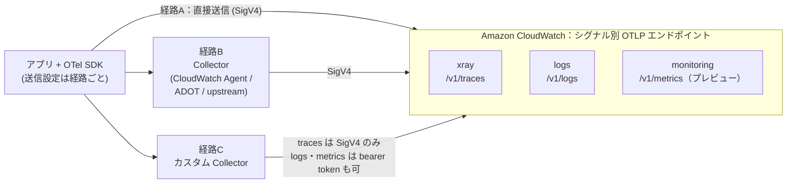
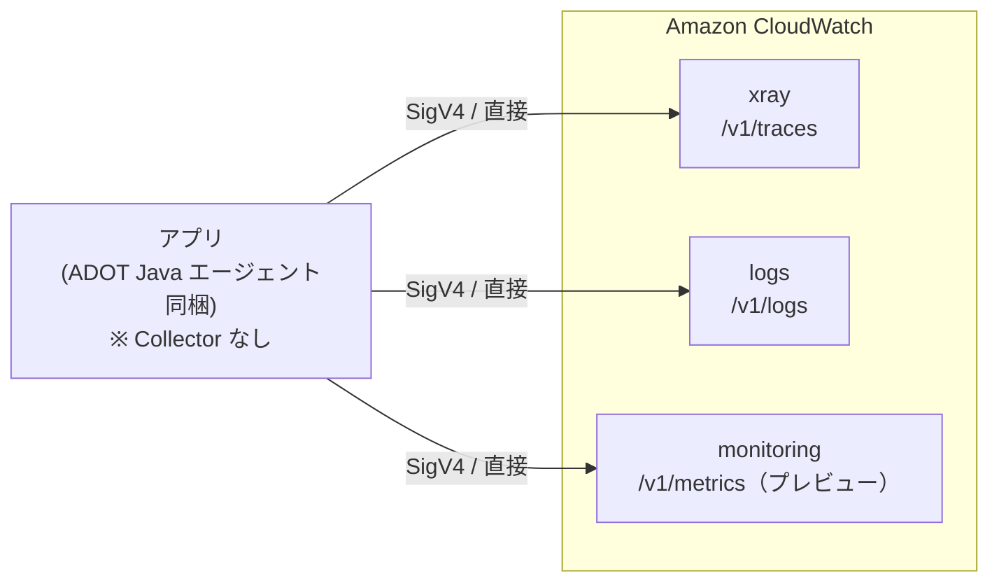
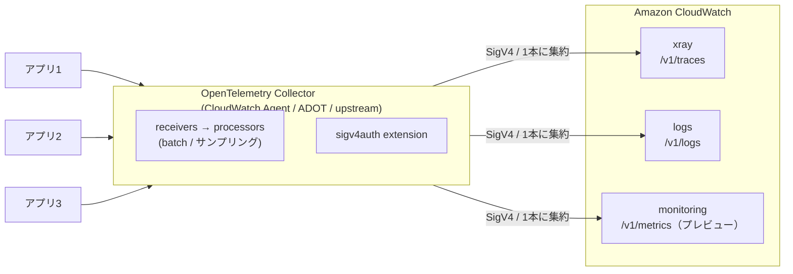

:::message
2026年6月に確認した AWS × OpenTelemetry の構成パターンを、ECS Fargate で試した結果と公式ドキュメントを基にまとめました。メトリクスの OTLP 直接取り込みはプレビュー時点の内容を含むため、採用前にリンク先の最新情報も確認してください。
:::

## この記事でわかること

- CloudWatch OTLP 直接送信と Collector 経由の違い
- どの構成を、どんな条件で選ぶべきか
- 導入前に知っておくべき制約・コスト・落とし穴

## はじめに：選択肢が増えて、むしろ迷うようになった

社内のシステムに OpenTelemetry（OTel：アプリからトレース・メトリクス・ログを出すための標準仕様と実装群）を導入しようとして、「で、結局どれを使えばいいの？」と迷ったのが、この記事を書いたきっかけです。

少し前まで、「AWS で OpenTelemetry をやる」と言えば答えはほぼ一つでした。ADOT（AWS が提供する OpenTelemetry ディストリビューション）の Collector（アプリとバックエンドの間でテレメトリを集約・加工・転送するコンポーネント）を立て、X-Ray と CloudWatch に送る。それ以外の道は事実上なかったのです。

ところが状況は変わりました。CloudWatch が **トレース・ログ・メトリクスの3シグナルすべてを OTLP（OTel のデータ送信プロトコル）で直接受信できる** ようになり、Collector を一切挟まずに送るという選択肢が現実的になりました。トレース／ログについては [Transaction Search の提供（2024年11月）](https://aws.amazon.com/about-aws/whats-new/2024/11/amazon-cloudwatch-visibility-application-transactions/)で OTLP エンドポイント経由の取り込みが可能になり、メトリクスも [2026年4月に OTLP 直接取り込みが追加](https://aws.amazon.com/about-aws/whats-new/2026/04/amazon-cloudwatch-opentelemetry-metrics/)されました（執筆時点ではプレビュー）。これによって CloudWatch はオブザーバビリティの三本柱をオープン標準のプロトコル一本で受けられるようになっています。

つまり今は「ADOT 一択」ではなく、複数の入り口から選べる時代です。選択肢が増えたのは良いことですが、私も最初は「で、結局どれを使えばいいのか」がよくわからなくて困りました（同じように迷っている方は多いんじゃないかなと思います）。この記事はそこを自分なりに整理してみたものです。

## 1. まず決めること：Collector を置くか

私が最初に決められずにいたのは、Collector を置くかどうかでした。この記事では比較しやすいように、試した構成を次の3つに分けます。なお、これは AWS が定義する3分類ではありません。経路Cは経路Bのうち、Collector 自体を自前ビルドする場合を分けたものです。

- **経路A：collector-less（ADOT SDK で直接送信）** — アプリの SDK が CloudWatch / X-Ray の OTLP エンドポイントへ直接送る。最小構成。
- **経路B：Collector 経由（CloudWatch Agent / ADOT Collector / upstream Collector）** — アプリ → Collector → CloudWatch。集約・フィルタ・サンプリング・Prometheus 受信を担う。
- **経路C：カスタム Collector** — 標準に無いコンポーネントが要る、または非 AWS 環境から送るときに自前ビルドの Collector を使う。

今回検証した OTLP 構成では、3経路とも CloudWatch のシグナル別エンドポイントへ送ります。ただし、**経路だけを無条件に差し替えられるわけではありません**。自動・手動計装で作るスパンは再利用しやすい一方、SigV4 認証、exporter、サンプリング、Application Signals 用の processor、ログの送信先は構成ごとに見直します。また、後述する Fluent Bit の CloudWatch Logs output は OTLP エンドポイントを通りません。

**図1（今回比較した構成）**: A は SDK から直接、B/C は Collector を経由して、シグナル別の OTLP エンドポイントへ送ります。


```mermaid
flowchart LR
    SDK["アプリ + OTel SDK<br/>(送信設定は経路ごと)"]

    SDK -->|"経路A：直接送信 (SigV4)"| EP
    SDK --> COLB["経路B<br/>Collector<br/>(CloudWatch Agent /<br/>ADOT / upstream)"]
    SDK --> COLC["経路C<br/>カスタム Collector"]

    COLB -->|"SigV4"| EP
    COLC -->|"traces は SigV4 のみ<br/>logs・metrics は bearer token も可"| EP

    subgraph EP["Amazon CloudWatch：シグナル別 OTLP エンドポイント"]
        direction TB
        XRAY["xray<br/>/v1/traces"]
        LOGS["logs<br/>/v1/logs"]
        MON["monitoring<br/>/v1/metrics（プレビュー）"]
    end
```

> AWS アイコン付きの構成図です。再編集用の [draw.io ソース](/images/aws-otel-2026/01_decision_map.drawio) も置いています。


### 構成ごとの機能差

| 機能 | 経路A（collector-less / ADOT SDK） | 経路B（Collector 経由） | 経路C（Custom Collector） |
| --- | --- | --- | --- |
| Application Signals（APM・サービス検出・サービスマップ） | ○ | ○（CloudWatch Agent / ADOT Collector 前提。upstream単体は要確認） | △（要 `awsapplicationsignals` プロセッサ。標準の `collector-contrib` イメージには非同梱で、自前ビルドか ADOT Collector が必要。詳細は§8の実機検証） |
| スパン／トレースサマリの検索・分析 | ○ | ○ | ○ |
| ログサマリの検索・分析 | △（ログ送信手順はあるが、言語/SDK・機能差を確認） | ○ | ○ |
| AWS インフラ属性によるエンリッチメント | × | △（Collector種別による） | ○ |
| ランタイムメトリクス（JVM 等）とアプリの相関 | × | ×〜○（Collector種別による） | ○ |
| 対応シグナル | Metrics / Traces中心。Logsは言語/SDK依存 | 構成次第でLogs / Metrics / Traces | 構成次第でLogs / Metrics / Traces |

※ 経路Bの「Collector 経由」は、CloudWatch Agent / ADOT Collector / upstream OpenTelemetry Collector をまとめた呼び方です。Application Signals、AWSインフラ属性によるエンリッチメント、ランタイムメトリクス相関は、どの Collector ディストリビューションを使うかで変わります。実装時は AWS 公式の [feature support 表](https://docs.aws.amazon.com/AmazonCloudWatch/latest/monitoring/CloudWatch-OTLPGettingStarted.html)を確認してください。

ここで注意したいのは、**OTLP のスパンが Transaction Search で検索できることと、Application Signals のサービス指標が生成されることは別**だという点です。Application Signals には対応する ADOT SDK または `awsapplicationsignals` processor が必要です。特に経路Cは upstream Collector の標準イメージだけでは APM 指標が出ません（§8で実機検証）。

## 2. 先に知るべき共通制約

経路を選ぶ前に、全経路に共通でかかる制約を押さえます。

### OTLP エンドポイント（シグナルごとに別ホスト）

CloudWatch の OTLP エンドポイントは **シグナルごとに別ホスト** です（`us-east-1` の例）：

- トレース：`https://xray.us-east-1.amazonaws.com/v1/traces`
- ログ：`https://logs.us-east-1.amazonaws.com/v1/logs`
- メトリクス：`https://monitoring.us-east-1.amazonaws.com/v1/metrics`（[プレビュー](https://aws.amazon.com/about-aws/whats-new/2026/04/amazon-cloudwatch-opentelemetry-metrics/)）

プロトコルは **HTTP のみ（gRPC 非対応）**、OTLP 1.x、ペイロードは binary / json、圧縮は gzip か none。

### エンドポイントのサイズ制限（Collector を挟む理由にもなる）

- traces：1リクエスト最大 5MB / 10,000 spans
- metrics：1リクエスト最大 1MB / 1,000 datapoints
- logs：通常 1MB（リージョンによって Large Log Objects の扱いあり）

量が増えると、batch processor やサンプリングを挟む動機になります。これが経路B/Cの実利の一つです。

### 認証

- AWS 認証情報を使う場合は SigV4。upstream Collector の設定例では `sigv4auth` extension を使う。
- bearer token 認証は **メトリクスとログのみ**（サービスごとに別 API キー）。**トレースは bearer token 非対応で SigV4 のみ**。
- bearer token は長期キーなので、Secrets Manager / Parameter Store / Kubernetes Secret から注入する。設定ファイルへの直書きは全経路で禁止。

### Transaction Search

**トレースを OTLP エンドポイントに送る前に Transaction Search を有効化** しておくこと。これが有効でないとスパンが X-Ray OTLP エンドポイントに届きません。

### サンプリングとコスト（最重要の落とし穴）

collector-less で traces を直接送る場合、使用する ADOT SDK の既定値によっては **100% サンプリング** になります。X-Ray の集中サンプリングを使うには、対応する ADOT SDK とサンプリングルール取得先の設定が必要です。`xray` sampler は upstream の全言語 SDK で共通に使える設定ではありません。**PoC 後は、利用言語・エージェントの公式手順を確認してサンプリングを見直してください**。取り込み量とコストに直結します。

例としてローカルサンプリングで5%にする場合：

```bash
OTEL_TRACES_SAMPLER=parentbased_traceidratio
OTEL_TRACES_SAMPLER_ARG=0.05
```

ADOT Java で X-Ray 集中サンプリングを使う場合の設定例（CloudWatch Agent など、サンプリングルールを提供するコンポーネントが別途必要）：

```bash
OTEL_TRACES_SAMPLER=xray
OTEL_TRACES_SAMPLER_ARG=endpoint=http://cloudwatch-agent.amazon-cloudwatch:2000
```

## 3. 先にアプリを計装する

経路をどれにするかと関係なく、まずアプリを計装します。OTel SDK を入れ、自動計装で HTTP・DB・各種クライアントのスパンを取れるようにするのが基本です。

### 言語別の自動計装の現況

- **Java / Node.js / Python / .NET** — エージェント型の自動計装が整っており、コードをほぼ変えずにスパンとメトリクスを取得できます。
- **Go** — Go は Java / Node.js / Python / .NET のような一般的な言語エージェント型 auto-instrumentation ではなく、eBPF ベースの zero-code instrumentation（OpenTelemetry Go Automatic Instrumentation / OBI）が進行中（work in progress）です。`net/http`・`database/sql`・gRPC など対応パッケージはコード変更なしで取れますが、対応範囲・制約を確認し、必要に応じて手動計装を併用するのが現実的です。本番では eBPF のオーバーヘッドやシンボル情報を残したビルドが要る点にも注意します。

### リソース属性が可視化の質を決める

計装時に設定する **リソース属性** が、後の可視化での見え方を大きく左右します。特に重要なのが次の3つです。

- `service.name` — Application Signals のダッシュボードでサービス名として表示。未設定だと `UnknownService`。
- `deployment.environment` — アプリが動く環境。Application Signals の「Hosted In」として表示。
- `aws.log.group.names` — メトリクス↔ログ相関を有効化（複数なら `&` 区切り）。

これらは ADOT SDK では `OTEL_RESOURCE_ATTRIBUTES` で渡します。X-Ray のトレースアノテーションや CloudWatch メトリクスのディメンションにも変換されるため、最初に丁寧に設計しておくと後の検索・フィルタが楽になります。

**コードサンプル①（最小計装・Java）**：ADOT Java エージェントを取得してアタッチする最小例。

```bash
curl -L -O https://github.com/aws-observability/aws-otel-java-instrumentation/releases/latest/download/aws-opentelemetry-agent.jar

JAVA_TOOL_OPTIONS="-javaagent:./aws-opentelemetry-agent.jar" \
OTEL_RESOURCE_ATTRIBUTES="service.name=my-java-svc" \
java -jar my-app.jar
```

## 4. 経路A：CloudWatch に直接送る（collector-less / ADOT SDK）

最速で始められる道です。Collector を運用しないぶん、構成要素はアプリと IAM だけです。

ここで ADOT SDK を使うのは、今回の検証だけの都合ではありません。CloudWatch の OTLP エンドポイントへ AWS 認証情報で直接送るには、リクエストへの **SigV4 署名**が必要です。upstream OpenTelemetry SDK の標準 OTLP exporter は、この署名をそのままでは行わないため、エンドポイントを差し替えるだけでは同じ構成になりません。AWS が案内する collector-less の手順では、SigV4 署名に対応した **ADOT SDK** を使用します。本記事のコードサンプルと実機検証も ADOT Java エージェントを使っています。

OpenTelemetry の計装 API や OTLP のデータ形式が別物になるわけではないため、独自に SigV4 対応の exporter／送信処理を実装すれば upstream SDK から直接送ること自体は可能です。ただし、これは AWS 公式の collector-less 手順から外れ、認証処理も自分で保守する構成です。upstream SDK をそのまま使いたい場合は、アプリから Collector へ通常の OTLP で送り、Collector の `sigv4auth` extension で署名する **経路B** の方が素直です。

### 始める前の必須チェック

- **Transaction Search を有効化**（トレースを送るなら必須）。
- 重複コストを避けるため、ADOT SDK 側の Application Signals は無効（`OTEL_AWS_APPLICATION_SIGNALS_ENABLED=false`、デフォルト）のまま。
- **traces のサンプリングを確認**（デフォルト 100% の可能性。第2章参照）。
- ログ送信時は `x-aws-log-group` / `x-aws-log-stream` ヘッダで送信先を指定。**LogGroup / LogStream は事前作成が必要**。
- collector-less でもログ送信手順は用意されていますが、対応言語・バージョン・制約があるため、ログまで含める場合は利用言語ごとの ADOT SDK ドキュメントを確認してください。
- IAM は、トレースなら `AWSXrayWriteOnlyPolicy`、ログなら `logs:PutLogEvents` / `logs:DescribeLogGroups` / `logs:DescribeLogStreams`。認証情報は ADOT SDK が AWS SDK 経由で自動探索。
- 最低バージョン（Java）：ADOT Java エージェント 2.11.2 以降。

**図2（経路Aの最小構成）**: アプリ（ADOT Java エージェント同梱）が、3本のエンドポイントへ直接 SigV4 で送ります。間に Collector はありません。


```mermaid
flowchart LR
    APP["アプリ<br/>(ADOT Java エージェント同梱)<br/>※ Collector なし"]

    APP -->|"SigV4 / 直接"| XRAY["xray<br/>/v1/traces"]
    APP -->|"SigV4 / 直接"| LOGS["logs<br/>/v1/logs"]
    APP -->|"SigV4 / 直接"| MON["monitoring<br/>/v1/metrics（プレビュー）"]

    subgraph CW["Amazon CloudWatch"]
        direction TB
        XRAY
        LOGS
        MON
    end
```

> AWS アイコン付きの構成図です。再編集用の [draw.io ソース](/images/aws-otel-2026/02_route_a.drawio) も置いています。


**コードサンプル②（経路A 環境変数フルセット・Java）**：トレース＋ログを us-east-1 へ直接送る起動例。

```bash
JAVA_TOOL_OPTIONS="-javaagent:./aws-opentelemetry-agent.jar" \
OTEL_METRICS_EXPORTER=none \
OTEL_TRACES_EXPORTER=otlp \
OTEL_EXPORTER_OTLP_TRACES_PROTOCOL=http/protobuf \
OTEL_EXPORTER_OTLP_TRACES_ENDPOINT=https://xray.us-east-1.amazonaws.com/v1/traces \
OTEL_LOGS_EXPORTER=otlp \
OTEL_EXPORTER_OTLP_LOGS_PROTOCOL=http/protobuf \
OTEL_EXPORTER_OTLP_LOGS_ENDPOINT=https://logs.us-east-1.amazonaws.com/v1/logs \
OTEL_EXPORTER_OTLP_LOGS_HEADERS=x-aws-log-group=MyLogGroup,x-aws-log-stream=default \
OTEL_TRACES_SAMPLER=parentbased_traceidratio \
OTEL_TRACES_SAMPLER_ARG=0.05 \
OTEL_RESOURCE_ATTRIBUTES="service.name=my-java-svc" \
java -jar my-app.jar
```

> ※スパンは `aws/spans` ロググループに、ログは指定した LogGroup に入ります。

**経路Aが向くケース**：PoC、小〜中規模、AWS に閉じてよい構成、Collector の運用人員を割きたくないチーム。ECS / EC2 の小規模アプリは経路Aから始めやすいです。

## 5. 経路B：Collector / Fluent Bit を挟む（CloudWatch Agent / ADOT / upstream Collector）

経路A に Collector を1段足すと、何が解けるのか。ここでいう Collector は主に OpenTelemetry Collector を指しますが、ログ収集では Fluent Bit を組み合わせる構成も実務上よく使われます（後述）。

- **複数アプリ・ホストの集約** — CloudWatch への接続数を1本にまとめる。
- **送信前の加工** — 属性の付け外し、バッチ化、サンプリングを Collector 側で。アプリを再デプロイせずに量・中身を制御。
- **Prometheus 受信** — Prometheus receiver などで取り込んだメトリクスを、CloudWatch 側の対応機能で PromQL ライクに扱える構成を取りやすい（CloudWatch の OpenTelemetry メトリクス／PromQL 対応は[プレビュー](https://aws.amazon.com/about-aws/whats-new/2026/04/amazon-cloudwatch-opentelemetry-metrics/)）。

なお、AWS で最も無難に始める Collector 経由の構成は、CloudWatch Agent に含まれる pre-packaged OpenTelemetry setup を使う方法です。この記事では理解しやすさのため「Collector」と表現しますが、実装時は CloudWatch Agent / ADOT Collector / upstream Collector のどれを使うかを明示して選んでください。

### 設定の肝：otlphttp exporter + sigv4auth extension

送り先は経路A と同じ OTLP エンドポイントです。`otlphttp` exporter に `sigv4auth` extension を組み合わせ、シグナルごとに `service` を変えて認証します（ログ→`logs`、トレース→`xray`、メトリクス→`monitoring`）。IAM は EC2 / EKS いずれも `CloudWatchAgentServerPolicy`。EKS なら IRSA でロールをサービスアカウントに紐づけます。

**図3（経路Bの集約・加工構成）**: 複数のアプリ → 1つの Collector → 3エンドポイントへ。Collector 内に sigv4auth とパイプラインがあります。


```mermaid
flowchart LR
    A1["アプリ1"] --> COL
    A2["アプリ2"] --> COL
    A3["アプリ3"] --> COL

    subgraph COL["OpenTelemetry Collector<br/>(CloudWatch Agent / ADOT / upstream)"]
        direction TB
        PIPE["receivers → processors<br/>(batch / サンプリング)"]
        AUTH["sigv4auth extension"]
    end

    COL -->|"SigV4 / 1本に集約"| XRAY["xray<br/>/v1/traces"]
    COL -->|"SigV4 / 1本に集約"| LOGS["logs<br/>/v1/logs"]
    COL -->|"SigV4 / 1本に集約"| MON["monitoring<br/>/v1/metrics（プレビュー）"]

    subgraph CW["Amazon CloudWatch"]
        direction TB
        XRAY
        LOGS
        MON
    end
```

> AWS アイコン付きの構成図です。再編集用の [draw.io ソース](/images/aws-otel-2026/03_route_b.drawio) も置いています。


**コードサンプル③（Collector YAML、logs + traces を us-east-1 へ）**：

```yaml
receivers:
  otlp:
    protocols:
      grpc:
        endpoint: 0.0.0.0:4317
      http:
        endpoint: 0.0.0.0:4318
exporters:
  otlphttp/logs:
    compression: gzip
    logs_endpoint: https://logs.us-east-1.amazonaws.com/v1/logs
    headers:
      x-aws-log-group: MyApplicationLogs
      x-aws-log-stream: default
    auth:
      authenticator: sigv4auth/logs
  otlphttp/traces:
    compression: gzip
    traces_endpoint: https://xray.us-east-1.amazonaws.com/v1/traces
    auth:
      authenticator: sigv4auth/traces
extensions:
  sigv4auth/logs:
    region: "us-east-1"
    service: "logs"
  sigv4auth/traces:
    region: "us-east-1"
    service: "xray"
service:
  extensions: [sigv4auth/logs, sigv4auth/traces]
  pipelines:
    logs:
      receivers: [otlp]
      exporters: [otlphttp/logs]
    traces:
      receivers: [otlp]
      exporters: [otlphttp/traces]
```

> メトリクス用は exporter の endpoint を `https://monitoring.us-east-1.amazonaws.com/v1/metrics`、`sigv4auth` の `service` を `monitoring` にし、`batch` プロセッサ（例：`send_batch_size: 200`, `timeout: 10s`）を挟みます。

補足：Application Signals で確実に100%のスパンを記録したい重要アプリでは、SDK 側のサンプラーを `always_on` にしておくことが公式に推奨されています（コストとのトレードオフに注意）。

**経路Bが向くケース**：複数サービスを集約したい、本番でコスト・ノイズを制御したい、Prometheus 資産を活かしたい、AWS サポート付きにしたいチーム。EKS / 複数サービスなら経路Bが自然です。

### Fluent Bit はログ収集の現実解

ここで、AWS のログ収集でよく登場する **Fluent Bit** にも触れておきます。OpenTelemetry Collector がトレース・メトリクス・ログをまとめて扱える汎用パイプラインなのに対し、Fluent Bit はもともと **ログ収集・転送に強い軽量エージェント** です。EKS / ECS / EC2 では、アプリの標準出力やコンテナログを Fluent Bit で集めて CloudWatch Logs に送る構成がよく使われます。

すべてを OpenTelemetry Collector に寄せる必要はありません。実務では役割で分担する構成も自然です。ただし、Fluent Bit の `cloudwatch_logs` output は CloudWatch Logs API へ送るため、前章までの「CloudWatch OTLP へ送る経路」とは別経路です。

| 役割 | よく使うコンポーネント | 向いている用途 |
| --- | --- | --- |
| トレース | ADOT Java Agent + OTel Collector | X-Ray / Application Signals へ送る |
| メトリクス | OTel Collector / CloudWatch Agent | ランタイムメトリクス、Prometheus 受信、CloudWatch Metrics |
| ログ | Fluent Bit / CloudWatch Agent / OTel Collector | コンテナログ、標準出力、CloudWatch Logs |

ログだけを Fluent Bit に任せると、構成は次のようになります。

```text
Java App + ADOT Java Agent
  ├── traces → OTel Collector → X-Ray / Application Signals
  └── stdout logs → Fluent Bit → CloudWatch Logs
```

この構成の利点は、ログ収集を既存の Fluent Bit 運用に乗せつつ、トレースは OpenTelemetry の文脈で扱えることです。EKS では DaemonSet として Fluent Bit を配置し、各ノードのコンテナログを集める構成が取りやすく、ECS では FireLens 経由で Fluent Bit を使えます。

Fluent Bit から CloudWatch Logs に送る最小イメージは次のとおりです。

```yaml
pipeline:
  outputs:
    - name: cloudwatch_logs
      match: '*'
      region: us-east-1
      log_group_name: my-application-logs
      log_stream_prefix: from-fluent-bit-
      auto_create_group: on
```

実運用では、LogGroup を自動作成するか IaC で事前作成するか、ロググループ／ストリーム名を Kubernetes metadata から組み立てるか、retention policy をどこで管理するか、JSON で構造化して送るか、トレース相関のため trace id / span id をログに含めるか、といった点を検討します。

> Fluent Bit は OpenTelemetry Collector の完全な代替というより、ログ収集に強い軽量エージェントです。トレースやメトリクスまで含めて OpenTelemetry のパイプラインで統一したい場合は OTel Collector、ログ収集を堅実に運用したい場合は Fluent Bit、という役割分担で考えるとわかりやすいです（CloudWatch OTLP エンドポイントへ OpenTelemetry 形式で送る OpenTelemetry output plugin もありますが、まずは「ログは Fluent Bit、トレースは OTel Collector / ADOT SDK」と分けて考えるのが理解しやすいです）。

## 6. 経路C：カスタム Collector とマルチクラウド

標準ディストリビューションに無いレシーバ／プロセッサ／エクスポータが要る、または **AWS の外（他クラウド、オンプレ、CI/CD）からも送りたい** ときは、カスタム Collector を使います。

### bearer token 認証という逃げ道

AWS 認証情報を持たせられない環境では bearer token（API キー）認証が使えます。ただし制約があります。

- bearer token が使えるのは **メトリクスとログのエンドポイントのみ**（サービスごとに別 API キー）。
- **トレースは bearer token 非対応で SigV4 のみ**。

bearer token なら AWS SDK 依存も認証情報ファイルも要らないので、非 AWS プラットフォームでも Collector を動かせます。

**コードサンプル④（bearer token で metrics を送る、抜粋）**：

```yaml
extensions:
  bearertokenauth:
    filename: "/etc/otel/cw-api-key"
exporters:
  otlphttp:
    metrics_endpoint: "https://monitoring.us-east-1.amazonaws.com/v1/metrics"
    auth:
      authenticator: bearertokenauth
service:
  extensions: [bearertokenauth]
  pipelines:
    metrics:
      receivers: [otlp]
      processors: [batch]
      exporters: [otlphttp]
```

:::message alert
API キーを設定ファイルに直書きしない。`filename` でマウントしたシークレットを読むか、`${env:VAR}` でシークレットマネージャから注入します。
:::

**経路Cが向くケース**：マルチクラウド／ハイブリッド前提、将来 Grafana など AWS 外のバックエンドにも分岐させたい、標準に無いコンポーネントが要るチーム。オンプレ / 他クラウド / CI から送る場合も経路C（ただし traces は SigV4 が必要）。

## 7. 可視化レイヤ：どの経路でも CloudWatch でどう見えるか

経路A〜Cのどれを選んでも、可視化の入り口は基本的に共通です。

### Application Signals（APM の中心）

Transaction Search を有効にして OTLP で送ったスパンは検索・分析できます。一方、Application Signals のサービスマップやサービス指標を使うには、対応する ADOT SDK または Collector の `awsapplicationsignals` processor による追加処理が必要です。OTLP エンドポイントへ送るだけで自動的に有効になるわけではありません。

- **サービスマップ** — 検出したサービスと依存関係を自動マッピング。依存先のヘルスやデプロイ時刻も見える。
- **SLO / SLI** — 自動収集される Latency と Availability を SLI として、宣言的に SLO を定義できる。Availability は `(1 - Fault Rate) × 100`（Fault は 5xx）。エラーバジェットの消費が速いとアラートが上がる。
- **トラブルシューティングドロワー** — エラー率が高いサービスノードをクリックすると、指標・直近のデプロイ・依存先のヘルスが1か所に出る。

### トレース ↔ ログ の相関

Application Signals の trace to log correlation を有効にすると、トレース ID とスパン ID がアプリログに自動注入され、トレース詳細画面の下部に対応するログが出ます。

有効化はロギング設定側で行います。Java（Logback）なら encoder の pattern に次を挿入します：

```text
trace_id=%mdc{trace_id} span_id=%mdc{span_id} trace_flags=%mdc{trace_flags} %5p
```

トレース ID の MDC 注入やログ収集方法は、言語、ロギングライブラリ、EKS / ECS / EC2 の実行環境で手順が異なります。メトリクスからログへ移動できるようにする場合も、`aws.log.group.names` を付けるだけでなく、対象のロググループ名と実際の送信先が一致していることを確認します。

## 8. 実機検証メモ：ECS Fargate で3経路を動かしてわかったこと

ここまでの内容を確かめるため、**3経路すべてを ECS Fargate 上で `ap-northeast-1` に実際にデプロイ**して検証しました（Java アプリ＋ADOT Java エージェント 2.11.2-aws、DynamoDB を叩く最小ワークロード。経路は CDK の context フラグで切り替え）。ドキュメントだけでは気づきにくい落とし穴がいくつかあったので共有します。

### 実際のデモ画面（差し替え用プレースホルダー）

以下の3枚を、公開前に実環境のスクリーンショットへ差し替えます。経路ごとの差が追いやすいように、画面の役割と確認してほしいポイントを先にそろえています。

#### デモ画面1：経路A — Transaction Search でスパンを確認

:::message
**画像プレースホルダー**

- 予定ファイル：`/images/aws-otel-2026/04_route_a_transaction_search.png`
- 撮影画面：CloudWatch の Transaction Search（検索結果またはトレース詳細）
- 画面に含めるもの：`service.name`、トレース ID、HTTP ステータス、所要時間
- 確認ポイント：Collector を置かない構成でも、OTLP で送ったスパンを検索できること
:::

#### デモ画面2：経路B — トレースとアプリログの相関を確認

:::message
**画像プレースホルダー**

- 予定ファイル：`/images/aws-otel-2026/05_route_b_trace_log_correlation.png`
- 撮影画面：CloudWatch のトレース詳細と、同じ画面から参照できる関連ログ
- 画面に含めるもの：同一の `trace_id` / `span_id` がわかるトレースとログ
- 確認ポイント：Collector 経由で送ったトレースから、対応するアプリログをたどれること
:::

#### デモ画面3：経路C — Collector で付与した属性を確認

:::message
**画像プレースホルダー**

- 予定ファイル：`/images/aws-otel-2026/06_route_c_enriched_attributes.png`
- 撮影画面：CloudWatch のトレース詳細（属性一覧）
- 画面に含めるもの：Collector で付与した `demo.version` / `demo.pattern`
- 確認ポイント：カスタム Collector の `attributes` プロセッサによるエンリッチメントが反映されること
:::

> スクリーンショットを用意するときは、AWS アカウント ID、リソース ARN、内部 URL などをマスクし、上記の予定ファイル名で保存してから各プレースホルダーを画像記法へ置き換えます。

### Transaction Search の有効化＝「送信先を CloudWatch Logs に切り替える」こと

第2章で触れた「トレース送信前に Transaction Search を有効化」の実体は、**トレースセグメントの送信先を CloudWatch Logs に変更すること**でした。

```bash
aws xray update-trace-segment-destination --destination CloudWatchLogs
# ACTIVE になるまで数分。確認：
aws xray get-trace-segment-destination
#   → Destination: CloudWatchLogs / Status: ACTIVE
```

X-Ray Insights の有効化とは別物です。ここを `CloudWatchLogs` にしていないと、OTLP で送ったスパンは `aws/spans` に取り込まれず、コンソールにも CLI にも出てきません（「送れているはずなのに見えない」の典型原因）。

### collector-less はメトリクスを明示的に止める（`OTEL_METRICS_EXPORTER=none`）

ADOT エージェントの既定は `OTEL_METRICS_EXPORTER=otlp`（送信先 `localhost:4318`）です。Collector が居ない collector-less でそのまま起動すると、毎リクエスト「メトリクス送信に失敗（`localhost:4318` に接続不可）」の WARN/ERROR がログを埋めます。**コードサンプル②のように `OTEL_METRICS_EXPORTER=none` を明示**するのが正解でした（送りたいシグナルだけを有効化する）。

### 検証のときだけサンプリングを 100% にする

第2章のサンプリングの話は実感を伴いました。注意したいのは向きが2つあることです。ADOT SDK で **サンプラーを何も設定しなければ既定は 100%（`parentbased_always_on`）** で、こちらは PoC のまま放置すると取り込み量とコストが跳ねます（第2章の警告どおり）。一方、今回の検証では第2章のサンプルにならって **明示的に 5%（`parentbased_traceidratio` / `0.05`）を設定**していたため、逆に Lambda を数十回叩いた程度では `aws/spans` にスパンがほとんど出ず、「壊れている？」と勘違いしました。**動作確認の間だけ 100%（`1.0`）にして、確認できたら本来のレートに戻す**のが安全でした。要するに「既定は 100%」「サンプルの推奨は 5%」の両方を意識し、検証フェーズと本番フェーズで意図的に使い分けるのがポイントです。

### 経路C（カスタム Collector）の Application Signals は「そのままでは出ない」

ここが最大の発見でした。upstream の `otel/opentelemetry-collector-contrib` イメージには、**スパンから Application Signals 指標を生成する `awsapplicationsignals` プロセッサが含まれていません**（イメージの `components` サブコマンドで確認済み。同梱されるのは `awsemf` / `awsxray` / `awscloudwatchlogs` などのエクスポータのみ）。これは AWS マネージドの ADOT Collector 専用コンポーネントです。

加えて、ADOT Java エージェントは既定でメトリクスを OTLP 送信するため、カスタム Collector の設定に **metrics パイプラインが無いと `localhost:4318/v1/metrics` が HTTP 404 を返し続けます**（トレースとログは正常に流れます）。

したがって経路Cで Application Signals の APM（サービスマップ・SLO）まで見たいなら、次のいずれかが必要です。

- OpenTelemetry Collector Builder（`ocb`）で `awsapplicationsignals` を含む **独自ディストリビューションをビルド**する
- 素直に **AWS マネージドの ADOT Collector** を使う（ただし「カスタム Collector」の趣旨とは相反）
- APM は割り切り、トレース（Transaction Search）＋ログで運用し、`OTEL_METRICS_EXPORTER=none` で 404 を止める

一方で、**AWS インフラ属性でのエンリッチメントはカスタム Collector で問題なく効きました**。`attributes` プロセッサで全スパンに独自属性（例：`demo.version` / `demo.pattern`）を確実に付与できることを確認しています。比較表で経路Cが「エンリッチメント ○」なのは実機でもその通りでした。

> まとめると、経路Cは「トレース＋ログ＋属性エンリッチメント」までは標準イメージで完結しますが、**Application Signals の APM だけは追加のビルド作業（または ADOT Collector 併用）が要る**、というのが実機で得た結論です。比較表の経路C・Application Signals を「○」ではなく「△」に直したのはこのためです。

## 9. どの構成を選ぶか

| 軸 | 経路A（直接） | 経路B（Collector 経由） | 経路C（カスタム Collector） |
| --- | --- | --- | --- |
| 導入の速さ | ◎ 最速 | ○ | △ |
| 既存アプリへの初期導入コスト | ○ エージェント追加と送信設定 | △ 左記に加えてCollectorの配置・接続設定 | × 左記に加えてビルド・配布・更新手順の整備 |
| アプリごとの変更 | △ SigV4・送信先・サンプリングを各アプリに設定 | ○ 送信先をCollectorにそろえやすい | ○ 経路Bと同様（Collector側の検証は増える） |
| 運用負荷 | ◎ 低い（Collector なし） | △ Collector 運用が要る | △ 自前ビルド＋運用 |
| インフラ属性エンリッチメント | × | ○ | ○ |
| サンプリング／フィルタ制御 | △ アプリ側のみ | ◎ Collector 側で柔軟 | ◎ |
| 認証の柔軟性 | SigV4 | SigV4 | SigV4 ＋ bearer token（非AWS可） |
| 移植性／マルチクラウド | △ AWS 寄り | ○ | ◎ |
| 想定環境 | ECS / EC2 の小規模 | EKS / 複数サービス | オンプレ / 他クラウド / CI |

指針はシンプルです。

- **とにかく速く試したい / AWS に閉じてよい** → 経路A。
- **複数サービスを集約したい / 本番でコスト・ノイズを制御したい** → 経路B。
- **非 AWS 環境からも送る / 将来 AWS 外のバックエンドへ逃がしたい / 標準に無い部品が要る** → 経路C。

### 既存アプリに入れるときのコストも考える

1サービスだけに試すなら、経路AはCollectorを用意しないぶん早く始められます。ただし、既存アプリごとにADOTエージェントやSDKを追加し、IAM、OTLPエンドポイント、SigV4、サンプリングを設定します。サービス数が増えるほど設定の展開と変更管理が積み上がる点は見落としやすいところでした。

経路Bは、Collectorのデプロイ、可用性、リソース見積もり、アプリからCollectorへの通信経路を最初に用意する必要があります。その代わり、すでにOTLPで計装されているアプリなら、基本的には送信先をCollectorにそろえ、認証や加工をCollector側へ集約できます。既存のCloudWatch AgentやADOT Collectorを運用している環境では、この初期コストを下げられる場合もあります。

経路Cは経路Bの作業に加え、必要なコンポーネントを選び、Collectorをビルド、脆弱性対応、配布、更新する仕組みまで必要です。既存アプリ側の変更量が経路Bより大きいとは限りませんが、プラットフォーム側の導入コストは最も高くなります。

そのため、小さく試すなら経路Aは有力ですが、対象サービスが多い、ログ収集、tail sampling、複数送信先、Application Signalsが最初から要件にある、といった場合は経路Bから始める方が全体の移行コストを抑えられることがあります。経路Cは「非AWS環境だから」ではなく、標準ディストリビューションにないコンポーネントが本当に必要かを確認してから選ぶのがよいと思います。


## 最後に

私自身、3経路を動かしたことで、Collector の有無よりも「どのシグナルを送り、CloudWatch で何を見たいか」を先に決める方が選びやすいと感じました。トレース検索だけなのか、Application Signals まで使うのか、ログ相関やサンプリングをどこで行うのかを書き出してから、上の早見表に当てはめるのがおすすめです。

AWS の OpenTelemetry 対応はまだ進化中なので、今後さらに選択肢が整理されていくんじゃないかなと思います。まずは一度試してみていただければ嬉しいです！

## 参照した公式ドキュメント

- [OTLP Endpoints](https://docs.aws.amazon.com/AmazonCloudWatch/latest/monitoring/CloudWatch-OTLPEndpoint.html)
- [Getting started（経路比較表）](https://docs.aws.amazon.com/AmazonCloudWatch/latest/monitoring/CloudWatch-OTLPGettingStarted.html)
- [collector-less / ADOT SDK](https://docs.aws.amazon.com/AmazonCloudWatch/latest/monitoring/CloudWatch-OTLP-UsingADOT.html)
- [OpenTelemetry Collector 設定例](https://docs.aws.amazon.com/AmazonCloudWatch/latest/monitoring/CloudWatch-OTLPSimplesetup.html)
- [OpenTelemetry Go zero-code instrumentation](https://opentelemetry.io/docs/zero-code/go/)
- [Fluent Bit CloudWatch output plugin](https://docs.fluentbit.io/manual/data-pipeline/outputs/cloudwatch)
- [Fluent Bit OpenTelemetry output plugin](https://docs.fluentbit.io/manual/data-pipeline/outputs/opentelemetry)
- [AWS for Fluent Bit](https://github.com/aws/aws-for-fluent-bit)

### 関連アップデート記事

- [Amazon CloudWatch launches full visibility into application transactions（AWS What's New, 2024-11）](https://aws.amazon.com/about-aws/whats-new/2024/11/amazon-cloudwatch-visibility-application-transactions/)
- [Amazon CloudWatch now supports OpenTelemetry metrics in public preview（AWS What's New, 2026-04）](https://aws.amazon.com/about-aws/whats-new/2026/04/amazon-cloudwatch-opentelemetry-metrics/)
- [Introducing OpenTelemetry and PromQL support in Amazon CloudWatch（AWS Cloud Operations Blog）](https://aws.amazon.com/blogs/mt/introducing-opentelemetry-promql-support-in-amazon-cloudwatch/)
- [AWS Observability ICYMI: Jan-May 2026（AWS Cloud Operations Blog）](https://aws.amazon.com/blogs/mt/aws-observability-icymi-jan-may-2026/)

---

*本記事の技術的記述は、CloudWatch OTLP エンドポイント仕様、collector-less / ADOT SDK 手順、OpenTelemetry Collector 設定例、Application Signals のトレース↔ログ相関・サンプリング、OpenTelemetry Go 計装の各公式ドキュメント（2026年6月時点）を参照して裏取りしています。加えて第8章の内容は、3経路を ECS Fargate 上で `ap-northeast-1` に実際にデプロイして確認した実機検証に基づきます（ADOT Java エージェント 2.11.2-aws、`otel/opentelemetry-collector-contrib:0.119.0` で検証）。メトリクスの OTLP 直接取り込みおよび Go の zero-code 計装はいずれも進行中／プレビューのため、本番採用前に最新の提供状況を確認してください。*
