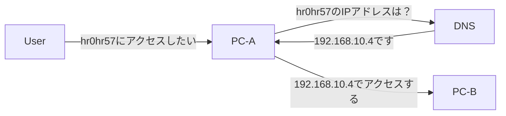

# Route53について

みなさんは`Route53`についてどれぐらい理解していますか？
AWSでシステムを構築する際に避けては通れないサービスの1つが`Route53`であり、かなりシステムのコアとなるDNSに関するサービスです。
AWSの[ホワイトペーパー](https://docs.aws.amazon.com/ja_jp/Route53/latest/DeveloperGuide/Welcome.html)によると、Route53とは、

> 可用性と拡張性に優れたドメインネームシステム (DNS) ウェブサービスです。Route 53 を使用すると、ドメイン登録、DNS ルーティング、ヘルスチェックの 3 つの主要な機能を任意の組み合わせで実行できます。

となっています。
では、そもそもこの`ドメインネームシステム(DNS)`とはいったい何なのかというところからおさえていこうと思います。

# DNSについて

DNSとは、`システムが持つIPアドレスとドメイン名を紐付けるためのシステム`です。
システム(コンピュータ)は必ずIPアドレスという、ネットワーク上のアドレス(住所)を持っています。これは、本来は2進数ですが、人間が分かりやすいように10進数で表記されます。例えば、192.168.1.1や52.12.46.23などがあります。IPアドレスにも決まりがあり、先の2つも本来は別のグループになりますが、ここでは割愛します。ざっくりいうと、全世界から参照できるIPアドレスと社内からだけ参照できるIPアドレスというのが存在します。プライベートIPやグローバルIPで検索してみてください。

では、ドメイン名の話を進めます。
先ほどのIPアドレスをすぐに覚えられた方はかなりの記憶力の持ち主ですが、そう多くは無いと思います。人間には数字の列を扱うのはかなりの至難の業なので、分かりやすい名前を付けて扱うことが基本です。普段の住所で考えると、郵便番号がIPアドレス、東京都～や北海道札幌市～等がドメイン名だとふんわりと理解してもらえればOKです。

この郵便番号と地名を紐付ける役割が、DNSです。

コンピューター同士が通信するとき、コンピューターは2進数しか扱えないため2進数のアドレスが使用されます。しかし、人間にとって理解が難しくなるため、設定などは10進数が使われています。それでも人間にとって意味のない数字を扱うことになるため、任意の名前を付けて使いやすくしましょう。

簡単にまとめると以下のフローになります。

この②を***名前解決***と呼びます。では名前解決はどのように行うのでしょうか。

方法はいくつかあります。
PC-Bのアドレスをすでに知っている、かつ、変わることがめったにない場合は、PC-A内の`hosts`という設定ファイルに記載することで名前解決を行う事ができます。
PC-Bのアドレスが分からない、さらにIPアドレスが頻繁に変わるという場合もあり、その場合hostsでの対応は不可能に近いです。このサポートをしてくれるのがDNSサービスであり、AWSでいうRoute53というわけです。

先ほどの構成図でフローを考えると、

